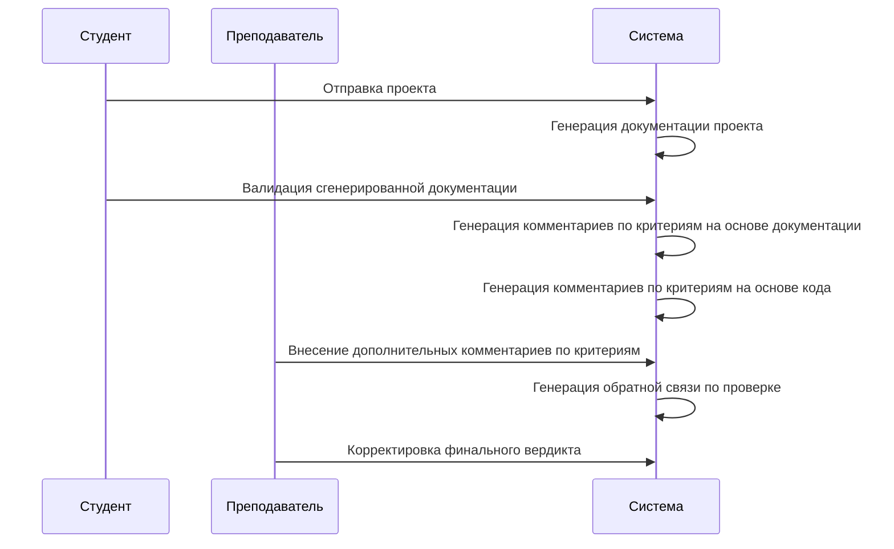
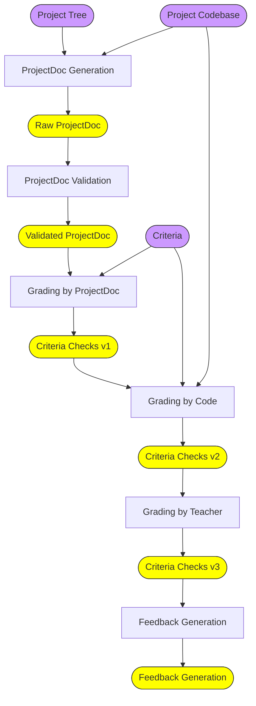

## Архитектура использования AI

### Взаимодействие студента, преподавателя и системы




### Общая схема генерации артефактов ревью



### Общая схема генерации артефактов ревью (на русском языке)
flowchart TB
    A2([Дерево проекта])
    A1([Кодовая база проекта])

    subgraph PG [Формирование проектной документации]
        direction LR
        Gen[Первичная генерация]
        Val[Валидация студентом]
        Gen --> Val
    end

    ValidatedDoc([Валидная документация])
    PG --> ValidatedDoc

    subgraph GR [Критериальная проверка]
        direction LR
        G1[Оценка по документации]
        G2[Оценка по коду]
        G3[Оценка преподавателем]
        G1 --> G2 --> G3
    end

    CriteriaChecks([Проверка критериев])
    GR --> CriteriaChecks

    FB[Генерация обратной связи]
    FB_out([Обратная связь])

    B1([Критерии])

    A1 --> PG
    A2 --> PG
    ValidatedDoc --> GR
    A1 --> GR
    B1 --> GR

    CriteriaChecks --> FB --> FB_out

    style A1 fill:#c9f,stroke:#333
    style A2 fill:#c9f,stroke:#333
    style B1 fill:#c9f,stroke:#333
    style ValidatedDoc fill:#ff0,stroke:#333
    style CriteriaChecks fill:#ff0,stroke:#333
    style FB_out fill:#ff0,stroke:#333
```