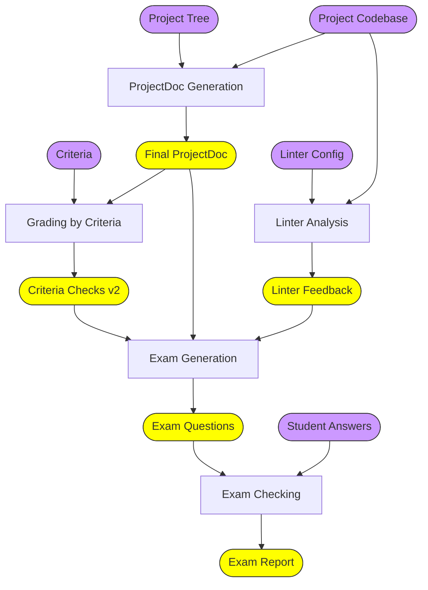
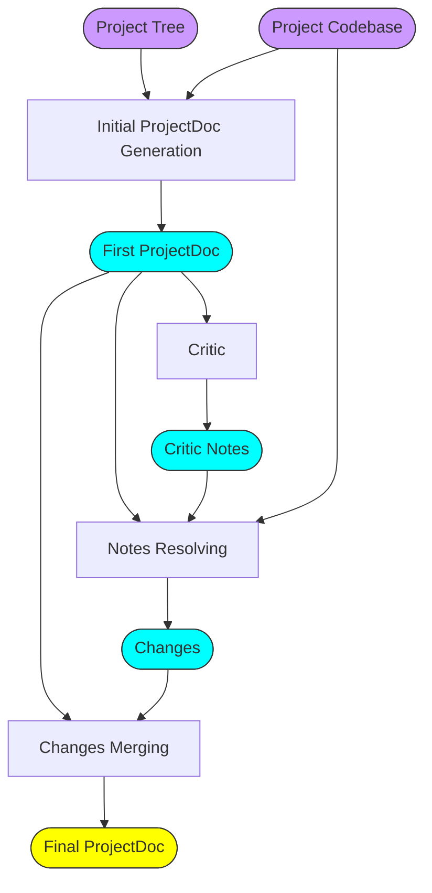
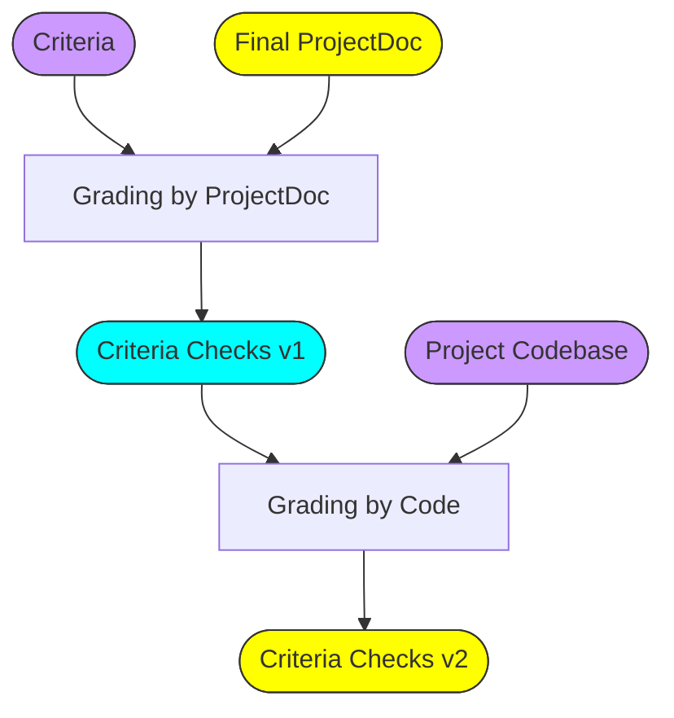

## Архитектура использования AI

### Общая схема генерации артефактов ревью




### Генерация ProjectDoc




### Ревью на основе критериев




[//]: # (### Генерация ProjectDoc)

[//]: # ()
[//]: # (```mermaid)

[//]: # (flowchart LR)

[//]: # (    A2&#40;[Project Tree]&#41;)

[//]: # (    A1&#40;[Project Codebase]&#41;)

[//]: # (    A3[Initial ProjectDoc Generation])

[//]: # (    A4&#40;[First ProjectDoc]&#41;)

[//]: # ()
[//]: # (    A5[Critic])

[//]: # (    A6&#40;[Critic Notes]&#41;)

[//]: # ()
[//]: # (    A7[Notes Resolving])

[//]: # (    A8&#40;[Changes]&#41;)

[//]: # ()
[//]: # (    A9[Changes Merging])

[//]: # (    A10&#40;[Final ProjectDoc]&#41;)

[//]: # ()
[//]: # (    A1 --> A3)

[//]: # (    A2 --> A3)

[//]: # (    A3 --> A4 --> A5 --> A6)

[//]: # (    A4 --> A7)

[//]: # (    A6 --> A7 --> A8)

[//]: # (    A4 --> A9)

[//]: # (    A8 --> A9 --> A10)

[//]: # ()
[//]: # ()
[//]: # (    B1&#40;[Criteria]&#41;)

[//]: # (    B2[Grading by ProjectDoc])

[//]: # (    B3&#40;[Criteria Checks v1]&#41;)

[//]: # (    B4[Grading by Code])

[//]: # (    B5&#40;[Criteria Checks v2]&#41;)

[//]: # (    B1 --> B2)

[//]: # (    A10 --> B2 --> B3 --> B4 --> B5)

[//]: # ()
[//]: # ()
[//]: # (    C1&#40;[Linter Config]&#41;)

[//]: # (    C2[Linter Running])

[//]: # (    C3&#40;[Linter Report]&#41;)

[//]: # (    C4[Report Analysis])

[//]: # (    C5&#40;[Linter Feedback]&#41;)

[//]: # ()
[//]: # (    C1 --> C2)

[//]: # (    A1 --> C2 --> C3 --> C4 --> C5)

[//]: # ()
[//]: # (    D1[Exam Generation])

[//]: # (    D2&#40;[Exam Questions]&#41;)

[//]: # ()
[//]: # (    A10 --> D1)

[//]: # (    B5 --> D1)

[//]: # (    C5 --> D1)

[//]: # (    D1 --> D2)

[//]: # ()
[//]: # ()
[//]: # (    %% Input Data)

[//]: # (    style A1 fill:#c9f,stroke:#333)

[//]: # (    style A2 fill:#c9f,stroke:#333)

[//]: # (    style B1 fill:#c9f,stroke:#333)

[//]: # (    style C1 fill:#c9f,stroke:#333)

[//]: # ()
[//]: # (    %% Artifacts)

[//]: # (    style A10 fill:#ff0,stroke:#333)

[//]: # (    style B5 fill:#ff0,stroke:#333)

[//]: # (    style C5 fill:#ff0,stroke:#333)

[//]: # (    style D2 fill:#ff0,stroke:#333)

[//]: # (```)

[//]: # ()
