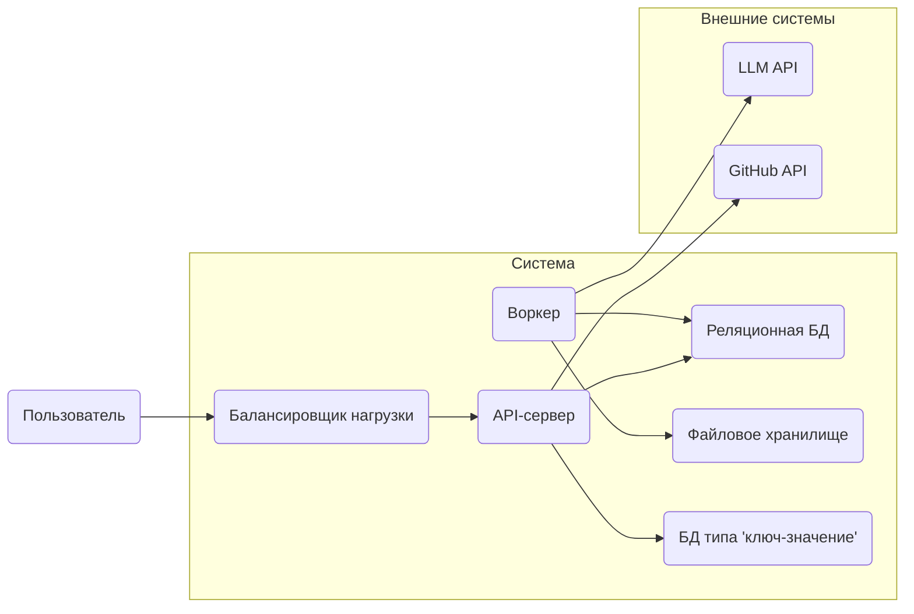
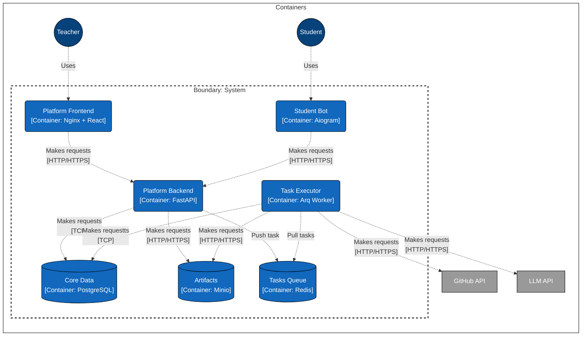

## Архитектура проекта

### Без технологий

```mermaid
flowchart LR
    user("Пользователь")

    subgraph System["Система"]
        balancer("Балансировщик нагрузки")
        api("API-сервер")
        worker("Воркер")
        db("Реляционная БД")
        storage("Файловое хранилище")
        cache("БД типа 'ключ-значение'")
    end
    subgraph External["Внешние системы"]
        llm("LLM API")
        github("GitHub API")
    end

    %% Коммуникации внутри
    balancer --> api
    
    api --> db
    api --> cache
    worker --> db
    worker --> storage

    %% Коммуникации с внешними системами
    worker --> llm
    api --> github

    %% Внешний доступ пользователя
    user --> balancer
```

### С4 - уровень компонентов

```mermaid
graph LR
    %% C4 style classes c4model.com %%
    classDef person fill:#08427b,stroke:black,color:white;
    classDef container fill:#1168bd,stroke:black,color:white;
    classDef database fill:#1168bd,stroke:black,color:white;
    classDef software fill:#1168bd,stroke:black,color:white;
    classDef existing fill:#999999,stroke:black,color:white;
    classDef boundary fill:white,stroke:black,stroke-width:2px,stroke-dasharray: 5 5;
    classDef frame fill:white,stroke:black;


    %% nodes %%
    GitHub["GitHub API"]:::existing
    LLM["LLM API"]:::existing
    Teacher((Teacher)):::person
    Student((Student)):::person
    Platform("Platform Frontend <br>[Container: Nginx + React]"):::container
    API("Platform Backend <br>[Container: FastAPI]"):::container
    TaskExecutor("Task Executor <br>[Container: Arq Worker]"):::container
    DB[("Core Data <br>[Container: PostgreSQL]")]:::database
    S3[("Artifacts <br>[Container: Minio]")]:::database
    Tasks[("Tasks Queue <br>[Container: Redis]")]:::database
    StudentBot("Student Bot <br>[Container: Aiogram]"):::container

    %% connections and boundaries %%
    
    subgraph Legend [Containers]
        Student-.->|Uses| StudentBot
        Teacher-.->|Uses| Platform
        
        subgraph Boundary["Boundary: System"]
            Platform-.->|"Makes requests <br> [HTTP/HTTPS]"| API
            StudentBot-.->|"Makes requests <br> [HTTP/HTTPS]"| API
            API-.->|"Makes requests  <br> [TCP]"| DB
            API-.->|"Makes requests <br> [HTTP/HTTPS]"| S3
            API-.->|"Push task"| Tasks

            TaskExecutor-.->|"Makes requestts <br> [TCP]"| DB
            TaskExecutor-.->|"Makes requests <br> [HTTP/HTTPS]"| S3
            TaskExecutor-.->|"Pull tasks"| Tasks
            
            

        end
        class Boundary boundary
        
        TaskExecutor-.->|"Makes requests <br> [HTTP/HTTPS]"| GitHub
        TaskExecutor-.->|"Makes requests <br> [HTTP/HTTPS]"| LLM
    end
    class Legend frame
```
