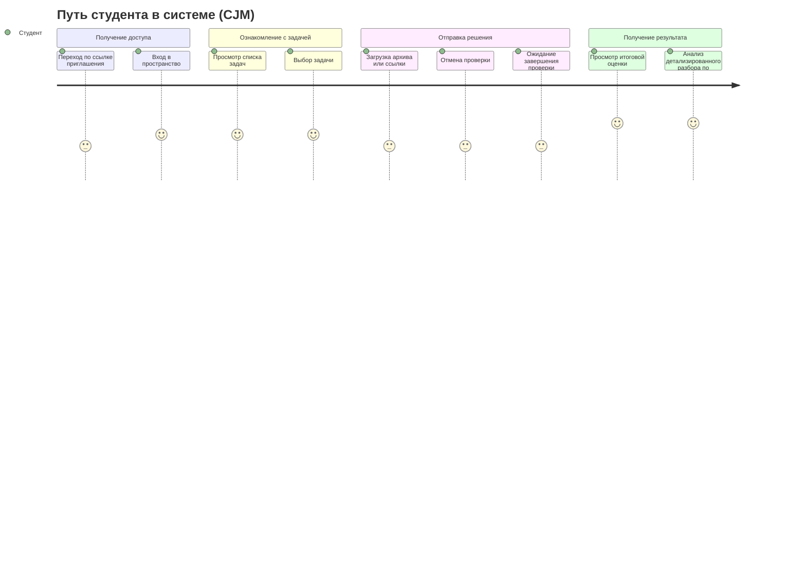
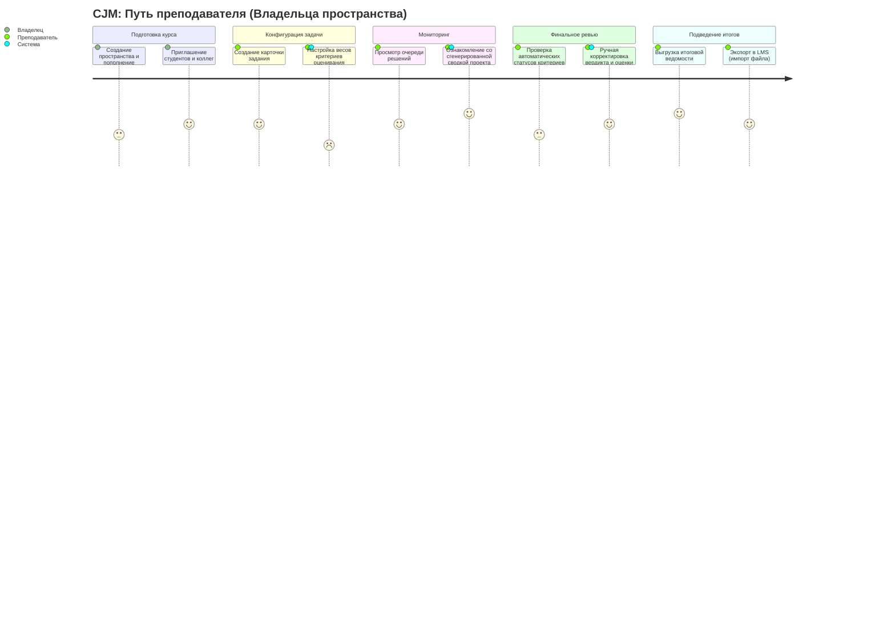

```mermaid
journey
    title Путь студента в системе (CJM)
    section Получение доступа
      Переход по ссылке приглашения: 3: Студент
      Вход в пространство: 4: Студент
    section Ознакомление с задачей
      Просмотр списка задач: 4: Студент
      Выбор задачи: 4: Студент
    section Отправка решения
      Загрузка архива или ссылки: 3: Студент
      Отмена проверки: 3: Студент
      Ожидание завершения проверки: 3: Студент
    section Получение результата
      Просмотр итоговой оценки: 5: Студент
      Анализ детализированного разбора по критериям: 5: Студент
```

```mermaid
journey
    title CJM: Путь преподавателя (Владельца пространства)
    section Подготовка курса
      Создание пространства и пополнение баланса: 3: Владелец
      Приглашение студентов и коллег: 4: Владелец
    section Конфигурация задачи
      Создание карточки задания: 4: Преподаватель
      Настройка весов критериев оценивания: 2: Преподаватель, Система
    section Мониторинг
      Просмотр очереди решений: 4: Преподаватель
      Ознакомление со сгенерированной сводкой проекта: 5: Преподаватель, Система
    section Финальное ревью
      Проверка автоматических статусов критериев: 3: Преподаватель
      Ручная корректировка вердикта и оценки: 4: Преподаватель, Система
    section Подведение итогов
      Выгрузка итоговой ведомости: 5: Преподаватель
      Экспорт в LMS (импорт файла): 4: Преподаватель
```