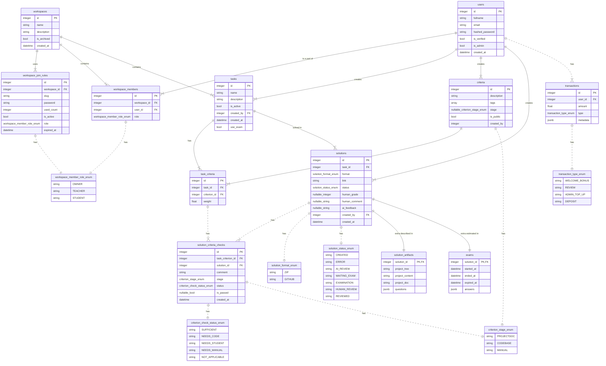

## Модель данных проекта

```mermaid
erDiagram
    users {
        integer id PK
        string fullname
        string email
        string hashed_password
        bool is_verified
        bool is_admin
        datetime created_at
    }
    
    workspaces {
        integer id PK
        string name
        string description
        bool is_archived
        datetime created_at
    }

    workspace_members  {
        integer id PK
        integer workspace_id FK
        integer user_id FK
        workspace_member_role_enum  role
    }

    workspace_member_role_enum {
        string OWNER
        string TEACHER
        string STUDENT
    }
    
    workspace_join_rules {
        integer id PK
        integer workspace_id FK
        string slug
        string password
        integer used_count
        bool is_active
        workspace_member_role_enum role
        datetime expired_at
    }

    tasks {
        integer id PK
        string name
        string description
        bool is_active
        integer created_by FK
        datetime created_at
        bool use_exam
    }
    
    criteria {
        integer id PK
        string description
        array tags
        nullable_criterion_stage_enum stage
        bool is_public
        integer created_by
    }
    
    criterion_stage_enum {
        string PROJECTDOC
        string CODEBASE
        string MANUAL
    }
    
    task_criteria {
        integer id PK
        integer task_id FK
        integer criterion_id FK
        float weight
    }

    solutions {
        integer id PK
        integer task_id FK
        solution_format_enum format
        string link
        solution_status_enum status
        nullable_integer human_grade
        nullable_string human_comment
        nullable_string ai_feedback
        integer created_by FK
        datetime created_at
    }
    
    solution_status_enum {
        string CREATED
        string ERROR
        string AI_REVIEW
        string WAITING_EXAM
        string EXAMINATION
        string HUMAN_REVIEW
        string REVIEWED
    }

    solution_format_enum {
        string ZIP
        string GITHUB
    }
    
    solution_criteria_checks {
        integer id PK
        integer task_criterion_id FK
        integer solution_id FK
        string comment
        criterion_stage_enum stage
        criterion_check_status_enum status
        nullable_bool is_passed
        datetime created_at
    }
    
    criterion_check_status_enum {
        string SUFFICIENT
        string NEEDS_CODE
        string NEEDS_STUDENT
        string NEEDS_MANUAL
        string NOT_APPLICABLE
    }

    solution_artifacts {
        integer solution_id PK, FK
        %% Raw data
        string project_tree
        string project_content
        %% Project-doc
        string project_doc
        %% Exam questions
        jsonb questions
        %% code, text
    }
    
    exams {
        integer solution_id PK, FK
        datetime started_at
        datetime ended_at
        datetime expired_at
        %% code, text
        jsonb answers
    }
    
    transactions {
        integer id PK
        integer user_id FK
        float amount
        transaction_type_enum type
        jsonb metadata
    }

    transaction_type_enum {
        string WELCOME_BONUS
        string REVIEW
        string ADMIN_TOP_UP
        string DEPOSIT
    }

    users ||--|{ workspace_members   : "is a part of"
    workspaces ||--|{ workspace_join_rules   : uses
    workspaces ||--|{ workspace_members   : contains
    workspace_members   ||..|| workspace_member_role_enum : has
    workspace_join_rules   ||..|| workspace_member_role_enum : has
    
    workspaces ||--|{ tasks : contains
    users ||--|{ tasks : creates
    users ||--|{ criteria : creates
    
    tasks ||--|{ task_criteria : "has"
    criteria ||--|{ task_criteria : "included in"
    criteria  ||..|| criterion_stage_enum : has
    
    solution_criteria_checks ||..|| criterion_check_status_enum : has
    solution_criteria_checks  ||..|| criterion_stage_enum : has
    solutions ||..|{ solution_criteria_checks : has
    task_criteria ||..|{ solution_criteria_checks : has
    
    users ||--|{ solutions : creates

    tasks ||--|{ solutions : "solved in"
    solutions ||..|| solution_format_enum : has
    solutions ||..|| solution_status_enum : has
    solutions ||--|| solution_artifacts: "extra described in"
    solutions ||--|| exams: "extra estimated in"
    
    users ||..|{ transactions : has
    transactions ||..|| transaction_type_enum : has
```
