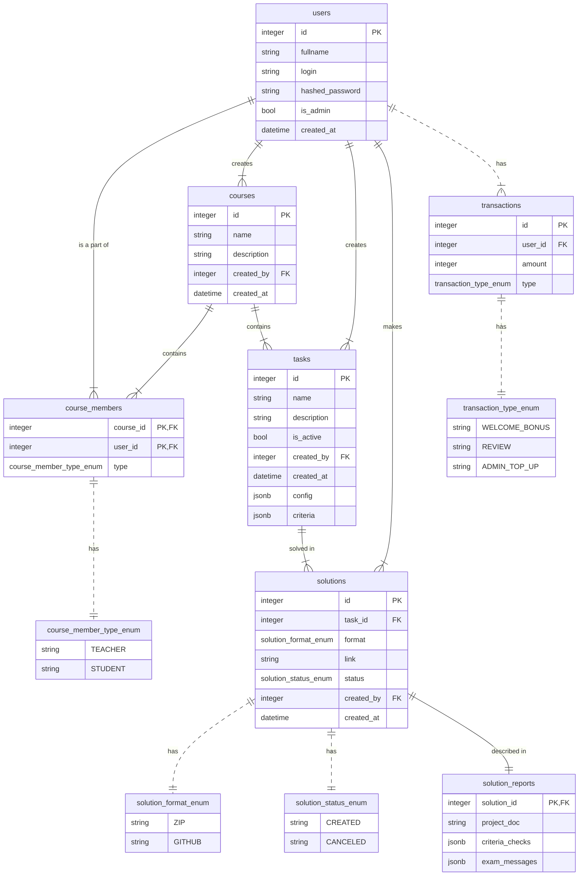

## Модель данных проекта

```mermaid
erDiagram
    users {
        integer id PK
        string fullname
        string login
        string hashed_password
        bool is_admin
        datetime created_at
    }

    tasks {
        integer id PK
        string name
        string description
        bool is_active
        integer created_by FK
        datetime created_at

        jsonb config 
        %% use_linters, use_sast, use_feedback, use_exam
        jsonb criteria 
        %% code (fastapi_023), description, weight
    }

    solutions {
        integer id PK
        integer task_id FK
        solution_format_enum format
        string link
        solution_status_enum status
        integer created_by FK
        datetime created_at
    }

    solution_status_enum {
        string CREATED
        string CANCELED
    }

    solution_format_enum {
        string ZIP
        string GITHUB
    }

    solution_reports {
        integer solution_id PK, FK
        string project_doc
        jsonb criteria_checks
        %% code, comment, confidence, value
        jsonb exam_messages
        %% role, content
    }

    transactions {
        integer id PK
        integer user_id FK
        integer amount
        transaction_type_enum type
    }

    transaction_type_enum {
        string WELCOME_BONUS
        string REVIEW
        string ADMIN_TOP_UP
    }

    courses {
        integer id PK
        string name
        string description
        integer created_by FK
        datetime created_at
    }

    course_members {
        integer course_id PK, FK
        integer user_id PK, FK
        course_member_type_enum  type
    }

    course_member_type_enum {
        string TEACHER
        string STUDENT
    }

    users ||--|{ course_members : "is a part of"
    users ||--|{ courses : creates
    courses ||--|{ course_members : contains
    course_members ||..|| course_member_type_enum : has
    
    courses ||--|{ tasks : contains
    users ||--|{ tasks : creates

    users ||--|{ solutions : makes

    tasks ||--|{ solutions : "solved in"
    solutions ||..|| solution_format_enum : has
    solutions ||..|| solution_status_enum : has
    solutions ||--|| solution_reports: "described in"
    
    users ||..|{ transactions : has
    transactions ||..|| transaction_type_enum : has
```
