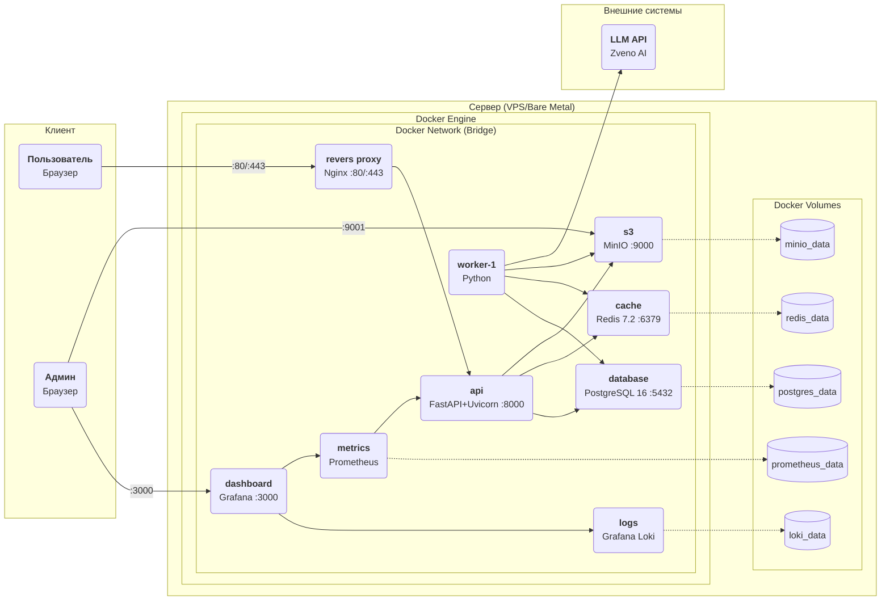

## Модель развертывания

```mermaid
flowchart LR
    subgraph External1["Клиент"]
        user("<b>Пользователь</b><br>Браузер")
        admin("<b>Админ</b><br>Браузер")
    end

    subgraph Server["Сервер (VPS/Bare Metal)"]
        subgraph DockerHost["Docker Engine"]
            subgraph Net["Docker Network (Bridge)"]
                nginx("<b>revers proxy</b><br>Nginx :80/:443")
                api("<b>api</b><br>FastAPI+Uvicorn :8000")
                worker1("<b>worker-1</b><br>Python")
                db("<b>database</b><br>PostgreSQL 16 :5432")
                redis("<b>cache</b><br>Redis 7.2 :6379")
                minio("<b>s3</b><br>MinIO :9000")
                loki("<b>logs</b><br>Grafana Loki")
                grafana("<b>dashboard</b><br>Grafana :3000")
                prom("<b>metrics</b><br>Prometheus")
            end
        end
        subgraph Volumes["Docker Volumes"]
            pg_data[("postgres_data")]
            minio_data[("minio_data")]
            loki_data[("loki_data")]
            prom_data[("prometheus_data")]
            redis_data[("redis_data")]
        end
    end

    subgraph External2["Внешние системы"]
        llm("<b>LLM API</b><br>Zveno AI")
    end

    %% Связи между контейнерами
    nginx --> api
    api --> db
    api --> redis
    api --> minio
    
    worker1 --> db
    worker1 --> redis
    worker1 --> minio
    
    grafana --> loki
    grafana --> prom
    worker1 --> llm

    %% Связи с внешним миром
    user -->|":80/:443"| nginx
    admin -->|":3000"| grafana
    admin -->|":9001"| minio

    %% Монтирование томов
    db -.-> pg_data
    minio -.-> minio_data
    loki -.-> loki_data
    redis -.-> redis_data
    prom -.-> prom_data
    
    prom --> api
```