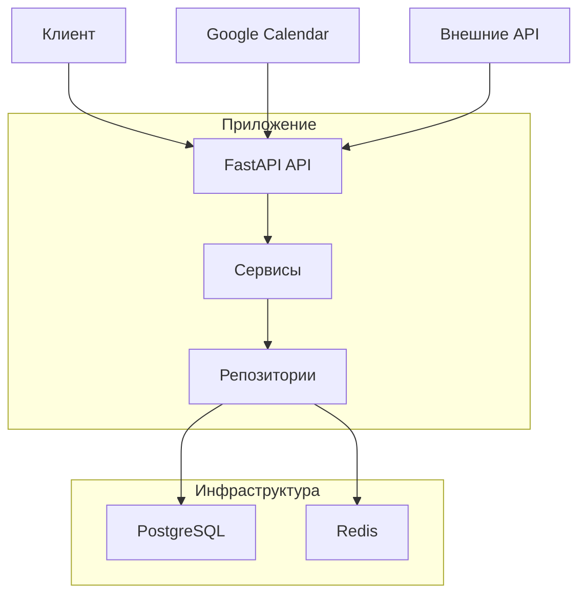
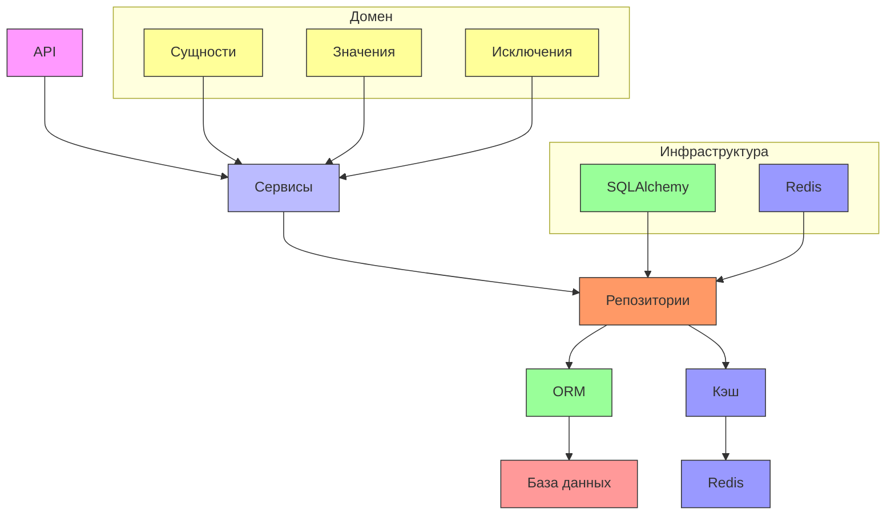
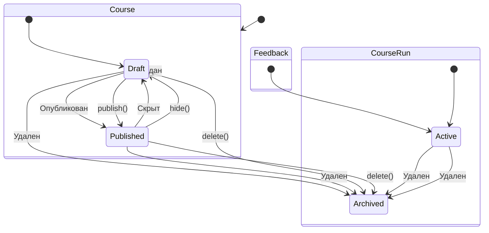
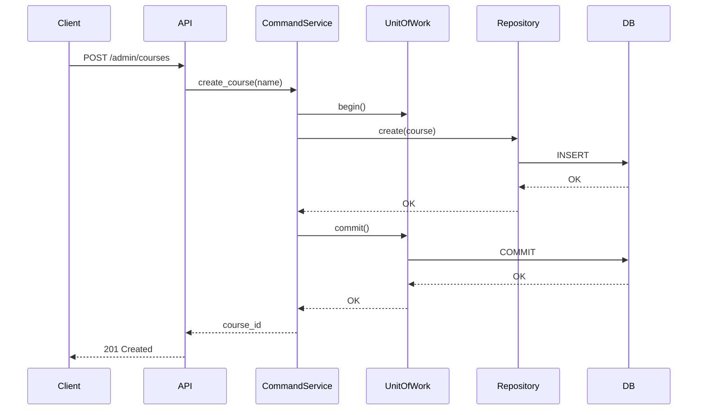
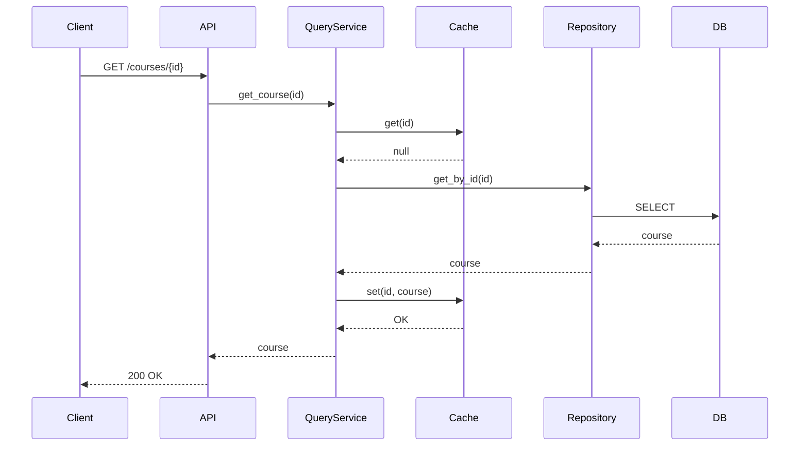
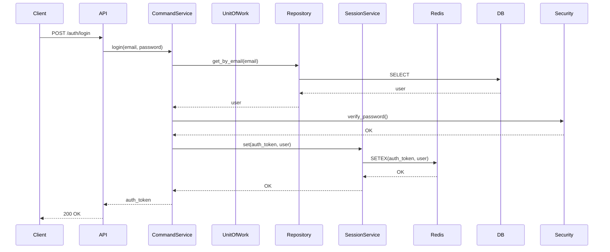
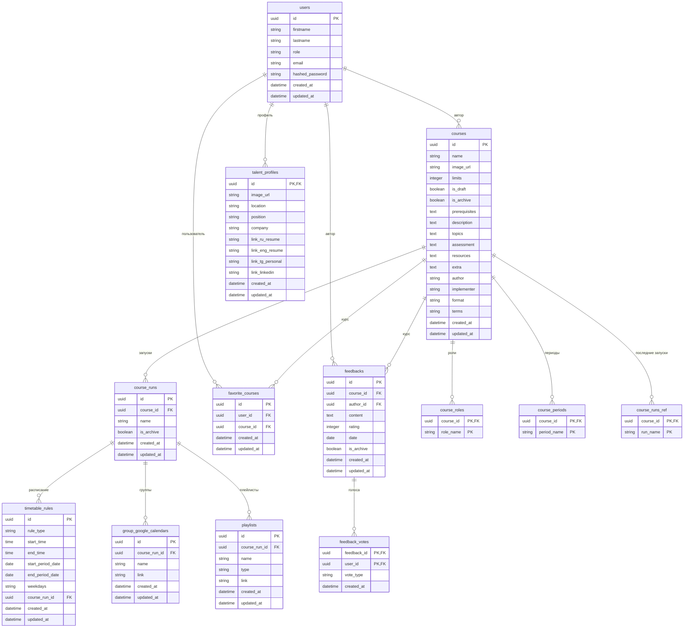
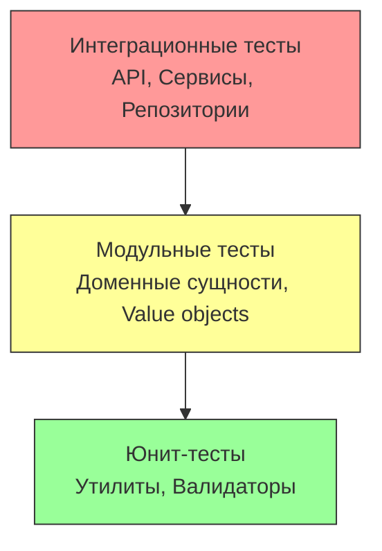

# ProjectDoc: AITH Courses Backend

## 1. Общая информация о проекте

### Название проекта
aith-courses

### Краткое описание
Проект представляет собой бэкенд-систему управления курсами для образовательной платформы. Основные функции включают:
- Управление курсами и их запусками
- Регистрацию и аутентификацию пользователей (администраторов и талантов)
- Систему отзывов и рейтингов курсов
- Управление расписанием занятий
- Работу с избранными курсами
- Профили пользователей
- Интеграцию с Google Calendar

Система решает задачи организации образовательного процесса, предоставления информации о курсах и взаимодействия между участниками образовательной платформы.

### Глоссарий
- **Талант (talent)**: пользователь платформы, проходящий курсы
- **Администратор (admin)**: пользователь с правами управления системой
- **Курс (course)**: образовательная программа, состоящая из нескольких запусков
- **Запуск курса (course run)**: конкретная реализация курса в определенный период времени
- **Расписание (timetable)**: набор правил, определяющих время и даты проведения занятий
- **Правило расписания (rule)**: правило, определяющее время проведения занятий (дневное или недельное)
- **Избранные курсы (favorite courses)**: курсы, добавленные пользователем в избранное
- **Профиль таланта (talent profile)**: персональная информация пользователя
- **Google Calendar группа**: ссылка на календарь Google для определенной группы занятий

## 2. Зависимости и технологический стек

### Языки программирования
- Python 3.11

### Ключевые библиотеки и фреймворки
- **FastAPI** (^0.111.0): веб-фреймворк для создания API
- **SQLAlchemy** (^2.0.31): ORM для работы с базой данных
- **asyncpg** (^0.29.0): асинхронный драйвер PostgreSQL
- **Redis** (^5.0.7): система кэширования и хранения сессий
- **Alembic** (^1.13.2): инструмент для миграций базы данных
- **Pydantic** (^2.3.4): валидация данных и работа с моделями
- **Uvicorn** (^0.30.1): ASGI-сервер

### Инструменты сборки, тестирования, линтеры
- **Poetry**: менеджер зависимостей и сборки
- **pytest** (^8.2.2): фреймворк для тестирования
- **httpx** (^0.27.0): HTTP-клиент для интеграционных тестов
- **ruff** (^0.5.0): линтер кода
- **Docker**: контейнеризация приложения
- **Docker Compose**: оркестрация контейнеров

## 3. Архитектура и структура проекта

### Структура директорий
```
aith-courses/
├── alembic/                    # Миграции базы данных
│   └── versions/               # Файлы миграций
├── integration_tests/          # Интеграционные тесты
├── src/                        # Исходный код приложения
│   ├── api/                    # Обработчики API
│   │   ├── admin/              # Административные эндпоинты
│   │   ├── auth/               # Аутентификация
│   │   ├── courses/            # Работа с курсами
│   │   ├── favorite_courses/   # Избранные курсы
│   │   ├── feedback/           # Отзывы
│   │   ├── playlists/          # Плейлисты
│   │   ├── talent_profile/     # Профили талантов
│   │   ├── timetable/          # Расписания
│   │   └── health_check.py     # Проверка работоспособности
│   ├── domain/                 # Доменные сущности
│   │   ├── auth/               # Аутентификация
│   │   ├── course_run/         # Запуски курсов
│   │   ├── courses/            # Курсы
│   │   ├── favorite_courses/   # Избранные курсы
│   │   ├── feedback/           # Отзывы
│   │   ├── group_google_calendar/ # Google Calendar группы
│   │   ├── playlists/          # Плейлисты
│   │   ├── talent_profile/     # Профили талантов
│   │   ├── timetable/          # Расписания
│   │   └── base_*              # Базовые классы
│   ├── infrastructure/         # Инфраструктурные компоненты
│   │   ├── fastapi/            # Настройки FastAPI
│   │   ├── redis/              # Работа с Redis
│   │   ├── security/           # Безопасность
│   │   └── sqlalchemy/         # Работа с SQLAlchemy
│   ├── services/               # Сервисные слои
│   │   ├── auth/               # Аутентификация
│   │   ├── course_run/         # Запуски курсов
│   │   ├── courses/            # Курсы
│   │   ├── favorite_courses/   # Избранные курсы
│   │   ├── feedback/           # Отзывы
│   │   ├── group_google_calendar/ # Google Calendar группы
│   │   ├── playlists/          # Плейлисты
│   │   ├── talent_profile/     # Профили талантов
│   │   ├── timetable/          # Расписания
│   │   └── base_unit_of_work.py # Базовый Unit of Work
│   ├── app.py                  # Точка входа приложения
│   ├── config.py               # Конфигурация
│   └── exceptions.py           # Исключения
├── unit_tests/                 # Модульные тесты
├── .env                        # Переменные окружения
├── .test.env                   # Переменные окружения для тестов
├── alembic.ini                 # Конфигурация Alembic
├── dev.docker-compose.yaml     # Docker Compose для разработки
├── Dockerfile.production       # Dockerfile для продакшена
├── entrypoint.sh               # Скрипт запуска
├── poetry.lock                 # Блокировка зависимостей
├── pyproject.toml              # Конфигурация Poetry
├── readme.md                   # Документация
└── test.docker-compose.yaml    # Docker Compose для тестов
```

### Архитектурная парадигма
Проект использует **слоистую архитектуру** с элементами **CQRS (Command Query Responsibility Segregation)** и **чистой архитектуры**.

**Пояснения:**
- **Слоистость**: приложение разделено на слои - API, сервисы, домен, инфраструктура
- **CQRS**: разделение команд (изменение состояния) и запросов (чтение состояния) в сервисных слоях
- **Чистая архитектура**: доменные сущности не зависят от инфраструктурных деталей
- **Unit of Work**: используется для управления транзакциями
- **Repository Pattern**: абстракции для доступа к данным

### Диаграмма верхнеуровневой архитектуры


### Диаграмма внутренних компонентов


### Диаграмма изменения статусов


### Диаграммы последовательности
**Создание курса:**


**Получение курса с кэшированием:**


**Аутентификация пользователя:**


### Схема базы данных


## 4. Основные обработчики в системе

### API-эндпоинты

**Аутентификация:**
- `POST /api/v1/auth/register` - Регистрация пользователя
  - Параметры: firstname, lastname, email, password
  - Схема запроса: `RegisterRequest`
  - Схема ответа: `AuthTokenResponse`
  - Назначение: Регистрация нового пользователя в системе

- `POST /api/v1/auth/login` - Вход в систему
  - Параметры: email, password
  - Схема запроса: `LoginRequest`
  - Схема ответа: `AuthTokenResponse`
  - Назначение: Аутентификация пользователя и получение токена

- `POST /api/v1/auth/logout` - Выход из системы
  - Параметры: auth_token (в заголовке)
  - Схема ответа: `SuccessResponse`
  - Назначение: Завершение сессии пользователя

- `GET /api/v1/auth/me` - Получение текущего пользователя
  - Параметры: auth_token (в заголовке)
  - Схема ответа: `UserDTO`
  - Назначение: Получение информации о текущем пользователе

**Курсы:**
- `GET /api/v1/courses` - Получение всех курсов
  - Параметры: terms, roles, implementers, formats, query, page, only_actual
  - Схема ответа: `CoursesPaginationResponse`
  - Назначение: Получение списка курсов с фильтрацией и пагинацией

- `GET /api/v1/courses/{course_id}` - Получение курса
  - Параметры: course_id
  - Схема ответа: `CourseFullDTO`
  - Назначение: Получение полной информации о курсе

- `GET /api/v1/courses/{course_id}/favorite_status` - Статус избранного
  - Параметры: course_id
  - Схема ответа: `CourseFavoriteStatusResponse`
  - Назначение: Проверка, добавлен ли курс в избранное

- `POST /api/v1/admin/courses` - Создание курса
  - Параметры: name
  - Схема запроса: `CreateCourseRequest`
  - Схема ответа: `CreateCourseResponse`
  - Назначение: Создание нового курса (только для администраторов)

- `PUT /api/v1/admin/courses/{course_id}` - Обновление курса
  - Параметры: course_id
  - Схема запроса: `UpdateCourseRequest`
  - Схема ответа: `SuccessResponse`
  - Назначение: Обновление информации о курсе (только для администраторов)

- `DELETE /api/v1/admin/courses/{course_id}` - Удаление курса
  - Параметры: course_id
  - Схема ответа: `SuccessResponse`
  - Назначение: Удаление курса (только для администраторов)

- `POST /api/v1/admin/courses/{course_id}/published` - Публикация курса
  - Параметры: course_id
  - Схема ответа: `SuccessResponse`
  - Назначение: Публикация курса (только для администраторов)

- `DELETE /api/v1/admin/courses/{course_id}/published` - Скрытие курса
  - Параметры: course_id
  - Схема ответа: `SuccessResponse`
  - Назначение: Скрытие курса (только для администраторов)

**Отзывы:**
- `GET /api/v1/courses/{course_id}/feedbacks` - Получение отзывов
  - Параметры: course_id
  - Схема ответа: `list[FeedbackDTO]`
  - Назначение: Получение отзывов о курсе

- `POST /api/v1/courses/{course_id}/feedbacks` - Создание отзыва
  - Параметры: course_id
  - Схема запроса: `CreateFeedbackRequest`
  - Схема ответа: `CreateFeedbackResponse`
  - Назначение: Создание отзыва о курсе

- `DELETE /api/v1/courses/{course_id}/feedbacks/{feedback_id}` - Удаление отзыва
  - Параметры: course_id, feedback_id
  - Схема ответа: `SuccessResponse`
  - Назначение: Удаление отзыва (только автором)

- `POST /api/v1/courses/{course_id}/feedbacks/{feedback_id}/vote` - Голосование за отзыв
  - Параметры: course_id, feedback_id
  - Схема запроса: `VoteDTO`
  - Схема ответа: `SuccessResponse`
  - Назначение: Оценка отзыва (like/dislike)

- `DELETE /api/v1/courses/{course_id}/feedbacks/{feedback_id}/vote` - Отмена оценки
  - Параметры: course_id, feedback_id
  - Схема ответа: `SuccessResponse`
  - Назначение: Отмена оценки отзыва

**Профили талантов:**
- `GET /api/v1/talent/profile` - Получение профиля
  - Схема ответа: `TalentProfileDTO`
  - Назначение: Получение профиля текущего пользователя

- `PUT /api/v1/talent/profile/general` - Обновление профиля
  - Схема запроса: `ProfileGeneralUpdateRequest`
  - Схема ответа: `SuccessResponse`
  - Назначение: Обновление основной информации профиля

- `PUT /api/v1/talent/profile/links` - Обновление ссылок
  - Схема запроса: `ProfileLinksUpdateRequest`
  - Схема ответа: `SuccessResponse`
  - Назначение: Обновление ссылок в профиле

- `POST /api/v1/talent/profile` - Создание профиля
  - Схема ответа: `SuccessResponse`
  - Назначение: Создание профиля для пользователя

**Избранные курсы:**
- `GET /api/v1/talent/profile/favorites` - Получение избранных
  - Схема ответа: `list[FavoriteCourseDTO]`
  - Назначение: Получение списка избранных курсов

- `POST /api/v1/talent/profile/favorites` - Добавление в избранное
  - Схема запроса: `AddFavoriteCourseRequest`
  - Схема ответа: `SuccessResponse`
  - Назначение: Добавление курса в избранное

- `DELETE /api/v1/talent/profile/favorites/{favorite_course_id}` - Удаление из избранного
  - Параметры: favorite_course_id
  - Схема ответа: `SuccessResponse`
  - Назначение: Удаление курса из избранного

**Расписания:**
- `GET /api/v1/courses/{course_id}/timetable` - Получение расписания
  - Параметры: course_id
  - Схема ответа: `TimetableDTO`
  - Назначение: Получение актуального расписания курса

- `GET /api/v1/admin/courses/{course_id}/runs/{course_run_id}/timetable` - Получение расписания (админ)
  - Параметры: course_id, course_run_id
  - Схема ответа: `TimetableDTO`
  - Назначение: Получение расписания запуска курса (только для администраторов)

- `POST /api/v1/admin/courses/{course_id}/runs/{course_run_id}/timetable/rules` - Создание правила
  - Параметры: course_id, course_run_id
  - Схема запроса: `CreateOrUpdateRuleRequest`
  - Схема ответа: `CreateRuleResponse`
  - Назначение: Создание правила расписания (только для администраторов)

- `PUT /api/v1/admin/courses/{course_id}/runs/{course_run_id}/timetable/rules/{rule_id}` - Обновление правила
  - Параметры: course_id, course_run_id, rule_id
  - Схема запроса: `CreateOrUpdateRuleRequest`
  - Схема ответа: `SuccessResponse`
  - Назначение: Обновление правила расписания (только для администраторов)

- `DELETE /api/v1/admin/courses/{course_id}/runs/{course_run_id}/timetable/rules/{rule_id}` - Удаление правила
  - Параметры: course_id, course_run_id, rule_id
  - Схема ответа: `SuccessResponse`
  - Назначение: Удаление правила расписания (только для администраторов)

**Google Calendar группы:**
- `GET /api/v1/admin/courses/{course_id}/runs/{course_run_id}/timetable/google_calendar_groups` - Получение групп
  - Параметры: course_id, course_run_id
  - Схема ответа: `list[GroupGoogleCalendarDTO]`
  - Назначение: Получение групп Google Calendar для запуска курса

- `POST /api/v1/admin/courses/{course_id}/runs/{course_run_id}/timetable/google_calendar_groups` - Создание группы
  - Параметры: course_id, course_run_id
  - Схема запроса: `CreateGroupGoogleCalendarRequest`
  - Схема ответа: `SuccessResponse`
  - Назначение: Создание группы Google Calendar для запуска курса

- `DELETE /api/v1/admin/courses/{course_id}/runs/{course_run_id}/timetable/google_calendar_groups/{group_google_calendar_id}` - Удаление группы
  - Параметры: course_id, course_run_id, group_google_calendar_id
  - Схема ответа: `SuccessResponse`
  - Назначение: Удаление группы Google Calendar

**Плейлисты:**
- `GET /api/v1/courses/{course_id}/playlists` - Получение плейлистов
  - Параметры: course_id
  - Схема ответа: `list[PlaylistDTO]`
  - Назначение: Получение плейлистов для курса

- `GET /api/v1/admin/courses/{course_id}/runs/{course_run_id}/playlists` - Получение плейлистов (админ)
  - Параметры: course_id, course_run_id
  - Схема ответа: `list[PlaylistDTO]`
  - Назначение: Получение плейлистов для запуска курса (только для администраторов)

- `POST /api/v1/admin/courses/{course_id}/runs/{course_run_id}/playlists` - Создание плейлиста
  - Параметры: course_id, course_run_id
  - Схема запроса: `CreateOrUpdatePlaylistRequest`
  - Схема ответа: `SuccessResponse`
  - Назначение: Создание плейлиста для запуска курса

- `PUT /api/v1/admin/courses/{course_id}/runs/{course_run_id}/playlists/{playlist_id}` - Обновление плейлиста
  - Параметры: course_id, course_run_id, playlist_id
  - Схема запроса: `CreateOrUpdatePlaylistRequest`
  - Схема ответа: `SuccessResponse`
  - Назначение: Обновление плейлиста для запуска курса

- `DELETE /api/v1/admin/courses/{course_id}/runs/{course_run_id}/playlists/{playlist_id}` - Удаление плейлиста
  - Параметры: course_id, course_run_id, playlist_id
  - Схема ответа: `SuccessResponse`
  - Назначение: Удаление плейлиста для запуска курса

**Запуски курсов:**
- `GET /api/v1/admin/courses/{course_id}/runs` - Получение запусков
  - Параметры: course_id
  - Схема ответа: `list[CourseRunDTO]`
  - Назначение: Получение запусков курса (только для администраторов)

- `POST /api/v1/admin/courses/{course_id}/runs` - Создание запуска
  - Параметры: course_id
  - Схема запроса: `CreateCourseRunRequest`
  - Схема ответа: `CreateCourseRunResponse`
  - Назначение: Создание запуска курса (только для администраторов)

- `DELETE /api/v1/admin/courses/{course_id}/runs/{course_run_id}` - Удаление запуска
  - Параметры: course_id, course_run_id
  - Схема ответа: `SuccessResponse`
  - Назначение: Удаление запуска курса (только для администраторов)

**Интеграции:**
- `POST /api/v1/integrations/google_calendar_links` - Обновление ссылок Google Calendar
  - Схема запроса: `UpdateCourseGroupGoogleCalendarsRequest`
  - Схема ответа: `UpdateCourseGroupGoogleCalendarMessageResponse`
  - Назначение: Массовое обновление ссылок Google Calendar для курсов

**Мониторинг:**
- `GET /api/v1/health_check` - Проверка работоспособности
  - Схема ответа: `Health`
  - Назначение: Проверка работоспособности сервиса

## 5. Конфигурация проекта

### Основные константы и конфиги приложения
- `ApplicationMode`: перечисление режимов работы (DEV, PRODUCTION, TEST)
- `TIME_TO_LIVE_AUTH_SESSION`: время жизни сессии аутентификации (60 * 60 * 24 секунд)
- `PASSWORD_MIN_LENGTH`: минимальная длина пароля (8 символов)
- `TIME_TO_LIVE_ALL_COURSES`: время жизни кэша всех курсов (60 * 60 секунд)
- `TIME_TO_LIVE_ONE_COURSE`: время жизни кэша одного курса (24 * 60 * 60 секунд)
- `TIME_TO_LIVE_FEEDBACKS`: время жизни кэша отзывов (60 * 60 секунд)

### Переменные окружения
| Название | Описание | Значение по умолчанию |
|---------|---------|---------------------|
| POSTGRES_DB | Имя базы данных PostgreSQL | - |
| POSTGRES_USER | Пользователь PostgreSQL | - |
| POSTGRES_PASSWORD | Пароль пользователя PostgreSQL | - |
| POSTGRES_PORT | Порт PostgreSQL | - |
| POSTGRES_HOST | Хост PostgreSQL | - |
| REDIS_USER | Пользователь Redis | - |
| REDIS_USER_PASSWORD | Пароль пользователя Redis | - |
| REDIS_PORT | Порт Redis | - |
| REDIS_HOST | Хост Redis | - |
| MODE | Режим работы приложения (dev, production, test) | production |

Секреты отсутствуют в коде и передаются через переменные окружения.

## 6. Особенности реализации

### Нестандартные или критически важные алгоритмы

**1. Определение актуального запуска курса:**
```python
def is_actual_by_date(self, current_date: datetime.date) -> bool:
    month, year = current_date.month, current_date.year
    run_season, run_year = self.name.season, self.name.year
    if run_season == "Осень":
        # С предзаписи и до конца осеннего семестра
        return year == run_year and month in (8, 9, 10, 11, 12) or year == run_year + 1 and month == 1
    # С предзаписи и до конца весеннего семестра
    return year == run_year and month in (1, 2, 3, 4, 5, 6, 7)
```
Алгоритм определяет, является ли запуск курса актуальным для текущей даты. Учитывает, что осенний семестр начинается в августе и заканчивается в январе следующего года, а весенний - с января по июль.

**2. Генерация расписания из правил:**
```python
@property
def lessons(self) -> list[LessonTimeDuration]:
    current_lessons: list[LessonTimeDuration] = []
    for rule in self.rules:
        current_lessons.extend(rule.lessons)
    current_lessons.sort(key=lambda lesson: lesson.start_time)
    return current_lessons
```
Алгоритм генерирует список занятий из набора правил (дневных и недельных), объединяя их и сортируя по времени начала.

**3. Проверка пересечения занятий:**
```python
def check_lesson_intersection(self, other: TimetableEntity) -> None:
    lesson_intersection_error = TimetableError("Курсы имеют пересечения по времени проведения занятий")
    other_lessons = set(other.lessons)
    current_lessons = set(self.lessons)
    if current_lessons.intersection(other_lessons):
        raise lesson_intersection_error
    for current_lesson in current_lessons:
        for other_lesson in other_lessons:
            if current_lesson.start_time.date() != other_lesson.start_time.date():
                continue
            if (current_lesson.start_time < other_lesson.end_time
                    and other_lesson.start_time < current_lesson.end_time):
                raise lesson_intersection_error
```
Алгоритм проверяет пересечение занятий между двумя расписаниями, что важно для предотвращения конфликтов при записи на курсы.

**4. Массовое обновление Google Calendar групп:**
```python
async def update(self, record: UpdateGroupGoogleCalendarDTO, course_run_name: str) -> str:
    updated_groups = set(record.groups)
    # Курс -> Актуальный запуск курса -> Текущие календари для групп этого запуска
    course_name = CourseName(record.course_name)
    course = await self.uow.course_repo.get_by_name(course_name)
    course_runs = await self.uow.course_run_repo.get_all_by_course_id(course.id)
    actual_course_run = self.__get_actual_course_run(course_runs, course_run_name)
    if not actual_course_run:
        return "Для курса нет запуска с указанным названием"
    ggc_list = await self.uow.ggc_repo.get_all_by_course_run_id(actual_course_run.id)
    current_groups: set[UpdateGroupDTO] = {UpdateGroupDTO(g.name, g.link.value) for g in ggc_list}
    # Добавляем новые группы
    to_add_groups: set[UpdateGroupDTO] = updated_groups - current_groups
    # Удаляем старые группы
    to_remove_groups = current_groups - updated_groups
```
Алгоритм выполняет массовое обновление групп Google Calendar, определяя, какие группы нужно добавить, а какие удалить, используя операции над множествами.

### Паттерны проектирования

**1. CQRS (Command Query Responsibility Segregation):**
Реализован в сервисных слоях, где команды (изменение состояния) и запросы (чтение состояния) разделены:
- `CourseCommandService` - команды для работы с курсами
- `AdminCourseQueryService`, `TalentCourseQueryService` - запросы для работы с курсами

**2. Repository Pattern:**
Реализован для всех сущностей, предоставляет абстракции для доступа к данным:
- `ICourseRepository`, `SQLAlchemyCourseRepository`
- `IUserRepository`, `SQLAlchemyUserRepository`
- и другие

**3. Unit of Work:**
Реализован для управления транзакциями и координации нескольких репозиториев:
- `ServiceUnitOfWork`, `SQLAlchemyUnitOfWork`
- Конкретные реализации для каждого сервиса (например, `CoursesUnitOfWork`)

**4. Value Objects:**
Реализованы как неизменяемые объекты, представляющие значения:
- `UUID`, `Email`, `LinkValueObject`
- `CourseName`, `CourseRun`, `FeedbackText`, `Rating`

**5. Domain-Driven Design:**
Проект следует принципам DDD:
- Четкое разделение на слои (API, сервисы, домен, инфраструктура)
- Доменные сущности содержат бизнес-логику
- Использование Value Objects для представления значений

**6. Dependency Injection:**
Реализован через параметры функций и конструкторов:
- Сервисы получают Unit of Work через конструктор
- Репозитории получают сессию через конструктор
- Зависимости внедряются через параметры в обработчиках API

**7. Strategy Pattern:**
Реализован для кэширования:
- `CourseCacheService` - абстрактный класс
- `RedisCourseCacheService` - конкретная реализация

**8. Factory Method:**
Реализован в ORM-моделях:
- Методы `from_domain` и `to_domain` для преобразования между слоями

Все паттерны реализованы правильно и соответствуют лучшим практикам.

## 7. Наблюдаемость системы

### Логирование
- В проекте не обнаружено явного использования логирования
- Нет импорта библиотек для логирования (logging, structlog и др.)
- Нет вызовов логирования в коде
- Логирование не настроено в конфигурации

### Мониторинг
- В проекте не обнаружено явного использования мониторинга
- Нет импорта библиотек для мониторинга (prometheus-client, opentelemetry и др.)
- Нет эндпоинтов для сбора метрик
- Мониторинг не настроен в конфигурации

### Трейсинг
- В проекте не обнаружено явного использования трейсинга
- Нет импорта библиотек для трейсинга (opentelemetry, jaeger и др.)
- Нет настройки трейсинга в коде
- Трейсинг не настроен в конфигурации

**Вывод:** Система не имеет встроенной наблюдаемости. Для production-использования необходимо добавить логирование, мониторинг и трейсинг.

## 8. Тестирование

### Запуск тестов
Тесты запускаются с помощью pytest:
```bash
poetry run pytest -v unit_tests 
poetry run pytest -v integration_tests
```

Для запуска тестов требуется:
- Docker для запуска PostgreSQL и Redis
- Файл `.test.env` с переменными окружения для тестовой среды

### Ключевые фикстуры
- `test_app`: создание экземпляра FastAPI приложения
- `async_client`: асинхронный HTTP-клиент для тестирования API
- `async_db_engine`: движок базы данных для тестов
- `test_async_session`: тестовая сессия SQLAlchemy
- `test_cache_session`: тестовая сессия Redis
- `event_loop`: цикл событий для асинхронных тестов

### Общий подход для написания тестов
- **Модульные тесты (unit_tests)**: тестируют доменные сущности и value objects
  - Расположены в `unit_tests/domain/`
  - Проверяют корректность создания объектов и бизнес-логику
  - Не требуют внешних зависимостей

- **Интеграционные тесты (integration_tests)**: тестируют взаимодействие компонентов
  - Расположены в `integration_tests/`
  - Тестируют репозитории, сервисы и API
  - Используют реальные базу данных и Redis
  - Создают и удаляют тестовые данные

### Тесты проекта в виде пирамиды тестирования


**Пояснение:**
- **Основание пирамиды (зеленый)**: модульные тесты доменных сущностей и value objects - самые быстрые и надежные
- **Средний уровень (желтый)**: интеграционные тесты репозиториев и сервисов - тестируют взаимодействие компонентов
- **Вершина пирамиды (красный)**: интеграционные тесты API - самые медленные, но обеспечивают сквозное тестирование

## 9. Проблемы и зоны развития

### TODO / FIXME / HACK
В коде проекта не обнаружено комментариев с TODO, FIXME или HACK.

### Потенциальные баги и ограничения

**1. Проблемы с кэшированием:**
- При обновлении курса инвалидируется кэш только этого курса, но не обновляется кэш всех курсов
- При удалении курса инвалидируется кэш только этого курса, но не обновляется кэш всех курсов
- Это может привести к несогласованности данных между кэшем одного курса и кэшем всех курсов

**2. Проблемы с безопасностью:**
- Пароли хранятся с использованием pbkdf2_hmac, что правильно, но не указано количество итераций в конфигурации
- Нет ограничения на количество попыток входа, что делает систему уязвимой к брутфорсу
- Нет механизма сброса пароля

**3. Проблемы с производительностью:**
- При получении списка курсов с фильтрацией сначала загружаются все курсы в память, а затем применяются фильтры
- Это может привести к проблемам с производительностью при большом количестве курсов
- Фильтрация должна выполняться на уровне базы данных

**4. Проблемы с целостностью данных:**
- При удалении курса устанавливается флаг `is_archive`, но не удаляются связанные данные (отзывы, запуски и т.д.)
- Это может привести к накоплению "мертвых" данных в базе
- Нужно рассмотреть возможность каскадного удаления или архивации всех связанных данных

**5. Проблемы с расписанием:**
- При удалении запуска курса удаляются только правила расписания, но не удаляются связанные данные (Google Calendar группы, плейлисты)
- Это может привести к оставлению "висячих" данных

**6. Проблемы с архитектурой:**
- В некоторых сервисах нарушена инкапсуляция - например, `GroupGoogleCalendarCommandService` напрямую работает с несколькими репозиториями
- Это усложняет тестирование и поддержку
- Следует рассмотреть возможность создания отдельного сервиса для каждой сущности

**7. Проблемы с тестированием:**
- Нет тестов для некоторых критических сценариев, например:
  - Проверка пересечения расписаний
  - Проверка публикации курса с недостающими обязательными полями
  - Проверка ограничений на количество отзывов от одного пользователя
- Нет тестов производительности

**8. Проблемы с документацией:**
- Нет документации по API в формате OpenAPI/Swagger
- Нет документации по архитектуре и дизайну системы
- Нет документации по развертыванию в production

**9. Проблемы с наблюдаемостью:**
- Как уже отмечалось, отсутствует логирование, мониторинг и трейсинг
- Нет метрик для отслеживания производительности и ошибок
- Нет централизованного сбора логов

**10. Проблемы с масштабируемостью:**
- Нет механизма для обработки фоновых задач (например, отправка уведомлений)
- Нет очередей для асинхронной обработки
- Нет кэширования на уровне API

**Рекомендации по улучшению:**
1. Добавить полноценную систему наблюдаемости (логирование, мониторинг, трейсинг)
2. Оптимизировать запросы к базе данных, особенно для фильтрации курсов
3. Улучшить механизмы инвалидации кэша
4. Добавить ограничение на количество попыток входа
5. Реализовать механизм сброса пароля
6. Добавить тесты для всех критических сценариев
7. Рассмотреть возможность использования очередей для асинхронной обработки
8. Добавить документацию по API и архитектуре
9. Улучшить обработку ошибок и валидацию данных
10. Рассмотреть возможность использования более эффективных алгоритмов для генерации расписания