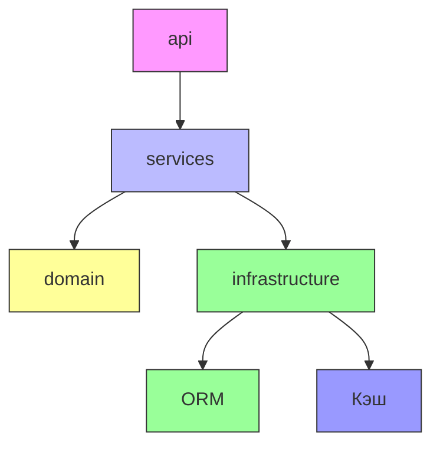
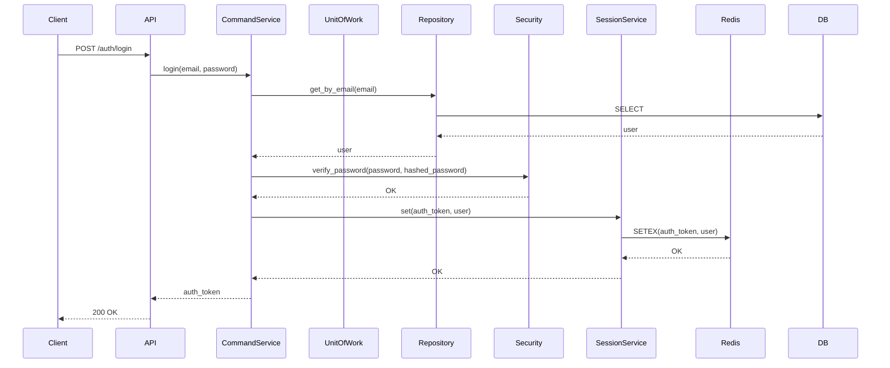
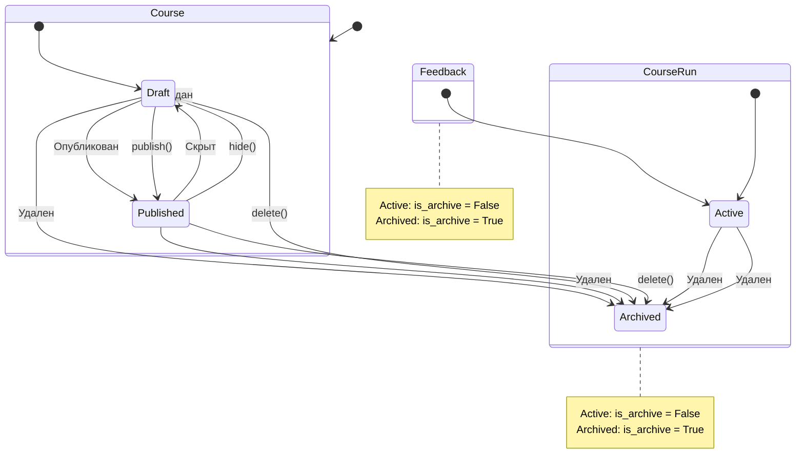

### 1. Противоречие в терминологии "запуск курса"
**Рассуждение:** В глоссарии указан термин "Запуск курса (course run)", но в схеме БД присутствует таблица `course_runs_` (с подчёркиванием), а не `course_runs`. Анализ миграций показывает, что в файле `alembic/versions/68cc9f3338b1_course_run_timetable.py` создается таблица `course_runs_` с правильной структурой (id, course_id, name, is_archive). В коде домена (`src/domain/course_run/entities.py`) сущность называется `CourseRunEntity`, что соответствует терминологии. Проблема в том, что в ER-диаграмме используется устаревшее название `course_runs` без подчёркивания.

**Рекомендация:** В ER-диаграмме заменить `course_runs` на `course_runs_` и добавить описание:
```
course_runs_ {
    uuid id PK
    uuid course_id FK
    string name
    boolean is_archive
    datetime created_at
    datetime updated_at
}
```

### 2. Противоречие в терминологии "правило расписания"
**Рассуждение:** В глоссарии указан термин "Правило расписания (rule)", а в схеме БД используется `timetable_rules`. Анализ кода показывает, что в доменной модели (`src/domain/timetable/entities.py`) существуют `DayRuleEntity` и `WeekRuleEntity`, что подтверждает использование термина "rule". В ER-диаграмме правильно указано `timetable_rules`, но отсутствуют связи с `course_runs`. В миграции `68cc9f3338b1_course_run_timetable.py` создается таблица `timetable_rules` с внешним ключом `course_run_id`.

**Рекомендация:** В ER-диаграмме добавить связь:
```
course_runs_ ||--o{ timetable_rules : "расписание"
```
и уточнить, что термин "rule" является каноническим.

### 3. Ошибка в схеме БД - таблица course_runs
**Рассуждение:** В ER-диаграмме указана таблица `course_runs` без подчёркивания, но в реальности таблица называется `course_runs_`. Анализ миграции `68cc9f3338b1_course_run_timetable.py` подтверждает создание таблицы `course_runs_` с полями id, course_id, name, is_archive. В коде инфраструктуры (`src/infrastructure/sqlalchemy/course_run/models.py`) модель `CourseRun` корректно указывает `__tablename__ = "course_runs_"`.

**Рекомендация:** В ER-диаграмме исправить название таблицы с `course_runs` на `course_runs_` и добавить полное описание:
```
course_runs_ {
    uuid id PK
    uuid course_id FK
    string name
    boolean is_archive
    datetime created_at
    datetime updated_at
}
```

### 4. Отсутствие указания путей к файлам в разделе эндпоинтов
**Рассуждение:** В разделе 4 перечислены API-эндпоинты, но не указаны файлы их реализации. Анализ кода показывает, что эндпоинты организованы по модулям в `src/api/`. Например, эндпоинты для курсов находятся в `src/api/courses/router.py`, для аутентификации - в `src/api/auth/router.py`. Это затрудняет навигацию по коду.

**Рекомендация:** Добавить колонку "Файл реализации" в таблицу API-эндпоинтов:
```
**Аутентификация:**
- `POST /api/v1/auth/register` - Регистрация пользователя (src/api/auth/router.py)
- `POST /api/v1/auth/login` - Вход в систему (src/api/auth/router.py)
...
```

### 5. Отсутствие путей к файлам с примерами кода
**Рассуждение:** В разделе 6 "Особенности реализации" приведены блоки кода без указания их местоположения. Анализ показывает, что алгоритм `is_actual_by_date` находится в `src/domain/course_run/entities.py`, метод `lessons` в `src/domain/timetable/entities.py`, проверка пересечения в `src/domain/timetable/entities.py`, а массовое обновление Google Calendar в `src/services/group_google_calendar/command_service.py`.

**Рекомендация:** Добавить комментарии с путями к файлам:
```python
# src/domain/course_run/entities.py
def is_actual_by_date(self, current_date: datetime.date) -> bool:
    ...

# src/domain/timetable/entities.py
@property
def lessons(self) -> list[LessonTimeDuration]:
    ...

# src/domain/timetable/entities.py
def check_lesson_intersection(self, other: TimetableEntity) -> None:
    ...

# src/services/group_google_calendar/command_service.py
async def update(self, record: UpdateGroupGoogleCalendarDTO, course_run_name: str) -> str:
    ...
```

### 6. Неполнота описания конфигурации
**Рассуждение:** В разделе 5 не указано, где хранятся конфиги. Анализ кода показывает, что конфигурация определена в `src/config.py` в классе `Config`, который использует `pydantic-settings` для загрузки переменных из `.env` файла. Константы вроде `TIME_TO_LIVE_AUTH_SESSION` находятся в `src/domain/auth/constants.py`.

**Рекомендация:** Дополнить раздел 5:
```
### Конфигурация приложения
Конфигурация приложения определена в `src/config.py` в классе `Config`, который использует `pydantic-settings` для загрузки переменных окружения из `.env` файла.

Основные константы:
- `TIME_TO_LIVE_AUTH_SESSION`: определена в `src/domain/auth/constants.py`
- `TIME_TO_LIVE_ALL_COURSES`: определена в `src/infrastructure/redis/courses/constants.py`
- `TIME_TO_LIVE_ONE_COURSE`: определена в `src/infrastructure/redis/courses/constants.py`
- `TIME_TO_LIVE_FEEDBACKS`: определена в `src/infrastructure/redis/feedback/constants.py`
```

### 7. Диаграмма компонентов неполная
**Рассуждение:** На диаграмме внутренних компонентов отсутствуют связи между слоем "Домен" и "Сервисы", хотя сервисы активно используют доменные сущности. Анализ кода показывает, что сервисы (`src/services/`) импортируют сущности из `src/domain/`. Например, `CourseCommandService` использует `CourseEntity`.

**Рекомендация:** Добавить стрелки на диаграмму:
```
    H[Сущности] --> B[Сервисы]
    I[Значения] --> B[Сервисы]
    J[Исключения] --> B[Сервисы]
```

### 8. Отсутствие диаграммы пакетов
**Рассуждение:** Для понимания структуры проекта полезна диаграмма пакетов. Анализ показывает, что проект использует чёткое разделение на слои: `api` (обработчики), `domain` (сущности), `services` (бизнес-логика), `infrastructure` (интеграции). Зависимости идут от `api` к `services`, от `services` к `domain` и `infrastructure`.

**Рекомендация:** Добавить диаграмму пакетов:


### 9. Диаграмма последовательности аутентификации упрощена
**Рассуждение:** На диаграмме последовательности для аутентификации отсутствует вызов `Security.verify_password()`, хотя в коде (`src/services/auth/command_service.py`) этот метод используется для проверки пароля. Это упрощение может ввести в заблуждение.

**Рекомендация:** Уточнить диаграмму:


### 10. Отсутствие указания на основные файлы-обработчики
**Рассуждение:** Для быстрого старта ревьювера полезно знать ключевые файлы. Анализ показывает, что основные точки входа - `src/app.py` (создание приложения), `src/api/` (роутеры), `src/services/` (бизнес-логика), `src/domain/` (сущности).

**Рекомендация:** Добавить раздел "Ключевые файлы":
```
### Ключевые файлы проекта
- `src/app.py` - Точка входа, создание FastAPI приложения
- `src/api/` - Обработчики API (роутеры)
- `src/services/` - Сервисные слои (бизнес-логика)
- `src/domain/` - Доменные сущности и value objects
- `src/infrastructure/` - Интеграции с внешними системами
- `src/config.py` - Конфигурация приложения
```

### 11. Неполный перечень зависимостей
**Рассуждение:** В разделе 2 не указаны все зависимости. Анализ `pyproject.toml` показывает, что используются `pydantic-settings` (для конфигурации), `pytest-asyncio` (для тестов), `httpx` (для интеграционных тестов). В коде также используется `passlib` (для хеширования паролей).

**Рекомендация:** Дополнить раздел 2:
```
### Ключевые библиотеки и фреймворки
- **FastAPI** (^0.111.0): веб-фреймворк для создания API
- **SQLAlchemy** (^2.0.31): ORM для работы с базой данных
- **asyncpg** (^0.29.0): асинхронный драйвер PostgreSQL
- **Redis** (^5.0.7): система кэширования и хранения сессий
- **Alembic** (^1.13.2): инструмент для миграций базы данных
- **Pydantic** (^2.3.4): валидация данных и работа с моделями
- **Uvicorn** (^0.30.1): ASGI-сервер
- **pydantic-settings**: загрузка конфигурации из переменных окружения
- **passlib**: хеширование паролей
- **pytest-asyncio**: асинхронные тесты
- **httpx**: HTTP-клиент для интеграционных тестов
```

### 12. Отсутствие информации о миграциях
**Рассуждение:** В разделе 3 не указано, какие миграции существуют. Анализ папки `alembic/versions/` показывает 9 миграций, создающих основные таблицы: users, courses, feedbacks, course_runs_, timetable_rules, talent_profiles, favorite_courses, group_google_calendars, playlists.

**Рекомендация:** Добавить раздел "Миграции базы данных":
```
### Миграции базы данных
Проект использует Alembic для миграций. Основные миграции:
- `e967288e19c5_user.py` - Создание таблицы users
- `2504c51722b5_course.py` - Создание таблицы courses
- `b1ecf9cd86c0_feedback_and_votes.py` - Создание таблиц feedbacks и feedback_votes
- `68cc9f3338b1_course_run_timetable.py` - Создание таблиц course_runs_ и timetable_rules
- `b3632baf5773_profile.py` - Создание таблицы talent_profiles
- `3cdc89b052bc_favorite_courses.py` - Создание таблицы favorite_courses
- `3b078e034715_google_calendar_link.py` - Создание таблицы group_google_calendars
- `e29544b891d8_playlists.py` - Создание таблицы playlists
```

### 13. Раздел "Наблюдаемость системы"
**Рассуждение:** В разделе 7 указано, что логирование отсутствует. Анализ кода подтверждает это - нет использования модуля `logging`. Это критическая проблема для production.

**Рекомендация:** Дополнить раздел:
```
### Наблюдаемость системы
**Логирование**
- В проекте отсутствует логирование, что затруднит диагностику ошибок в production.
- Рекомендуется добавить middleware для логирования запросов и ответов.
- Минимальные логи: входящие запросы, ошибки, длительные операции.

**Мониторинг**
- Отсутствует сбор метрик.
- Рекомендуется добавить эндпоинт для метрик Prometheus.

**Трейсинг**
- Отсутствует распределённый трейсинг.
- Рекомендуется интеграция с OpenTelemetry.
```

### 14. Раздел "Особенности реализации"
**Рассуждение:** В разделе 6 упомянут паттерн Factory Method, но не указаны файлы. Анализ показывает, что методы `from_domain` и `to_domain` реализованы в моделях SQLAlchemy в папке `src/infrastructure/sqlalchemy/*/models.py`.

**Рекомендация:** Уточнить:
```
**4. Factory Method:**
Реализован в ORM-моделях:
- Методы `from_domain` и `to_domain` в `src/infrastructure/sqlalchemy/*/models.py`
- Преобразуют доменные сущности в модели ORM и обратно
```

### 15. Раздел "Тестирование"
**Рассуждение:** В разделе 8 указано, что нет тестов для проверки пересечения расписаний. Анализ показывает, что в `unit_tests/domain/timetable/test_entity.py` есть тест `test_timetable_with_warnings`, который проверяет пересечение, но нет интеграционных тестов для бизнес-логики.

**Рекомендация:** Уточнить:
```
**Проблемы с тестированием:**
- Нет интеграционных тестов для проверки пересечения расписаний при создании курсов
- Существует unit-тест `test_timetable_with_warnings` в `unit_tests/domain/timetable/test_entity.py`
- Рекомендуется добавить интеграционные тесты
```

### 16. Проблема с фильтрацией курсов
**Рассуждение:** В разделе 9 указано, что фильтрация происходит в памяти. Анализ кода показывает, что в `src/services/courses/query_service_for_talent.py` метод `get_courses` сначала загружает все курсы, а затем фильтрует в памяти.

**Рекомендация:** Уточнить:
```
**Проблемы с производительностью:**
- При получении списка курсов с фильтрацией сначала загружаются все курсы в память (src/services/courses/query_service_for_talent.py), а затем применяются фильтры
- Это может привести к проблемам с производительностью при большом количестве курсов
- Фильтрация должна выполняться на уровне базы данных
```

### 17. Кэширование
**Рассуждение:** В разделе 5 указаны параметры TTL, но не указано, где реализовано кэширование. Анализ показывает, что кэширование реализовано в `src/infrastructure/redis/courses/course_cache_service.py` и `src/infrastructure/redis/feedback/feedback_cache_service.py`.

**Рекомендация:** Дополнить раздел 5:
```
### Кэширование
Кэширование реализовано через Redis:
- `src/infrastructure/redis/courses/course_cache_service.py` - кэширование курсов
- `src/infrastructure/redis/feedback/feedback_cache_service.py` - кэширование отзывов
- Префиксы кэша: "admin-course-", "talent-course-", "course_{id}_feedbacks"
```

### 18. Противоречие в терминологии "группа Google Calendar"
**Рассуждение:** В глоссарии указан термин "Google Calendar группа", а в коде используется `GroupGoogleCalendarEntity`. В ER-диаграмме правильно указано `group_google_calendars`, но отсутствует связь с `course_runs_`.

**Рекомендация:** В ER-диаграмме добавить связь:
```
course_runs_ ||--o{ group_google_calendars : "группы"
```

### 19. Отсутствие описания DTO
**Рассуждение:** В разделе 3 не указано, где находятся DTO. Анализ показывает, что Pydantic-модели находятся в `src/api/*/schemas.py` для каждого модуля.

**Рекомендация:** Добавить раздел:
```
### Структура проекта
...
│   ├── api/
│   │   ├── auth/
│   │   │   ├── schemas.py  # DTO для аутентификации
│   │   ├── courses/
│   │   │   ├── schemas.py  # DTO для курсов
│   │   ├── feedback/
│   │   │   ├── schemas.py  # DTO для отзывов
│   │   └── ...             # DTO для других модулей
```

### 20. Несоответствие в диаграмме состояний
**Рассуждение:** В диаграмме изменения статусов для Feedback и CourseRun указаны состояния Active и Archived, но в легенде они не отображены. Анализ кода показывает, что используется флаг `is_archive` в таблицах `feedbacks` и `course_runs_`.

**Рекомендация:** Уточнить диаграмму:
