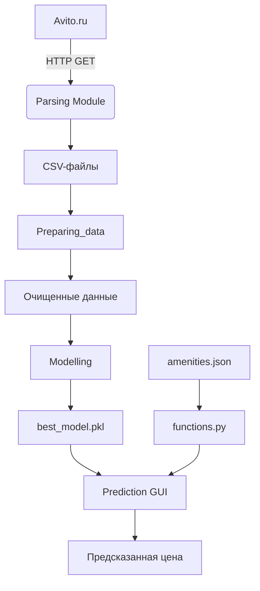
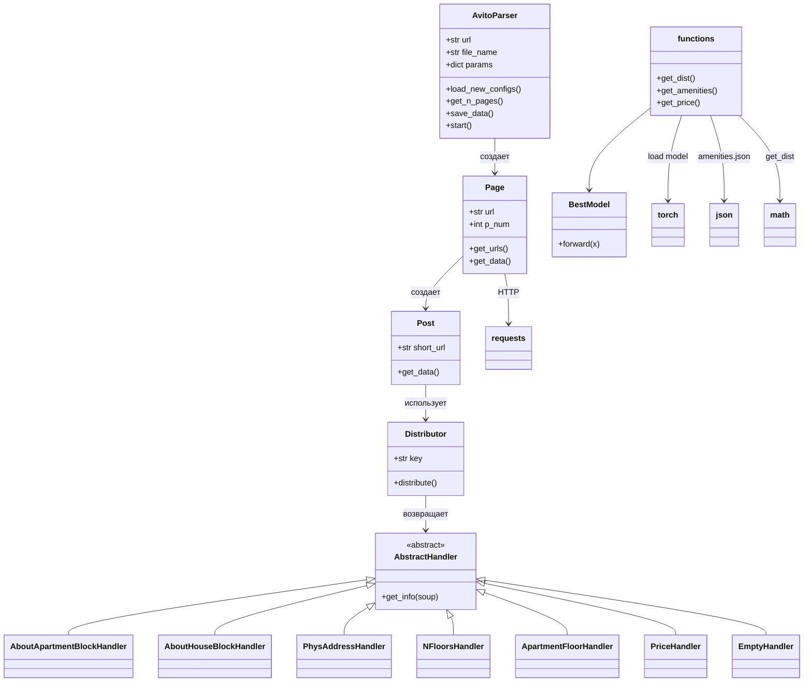
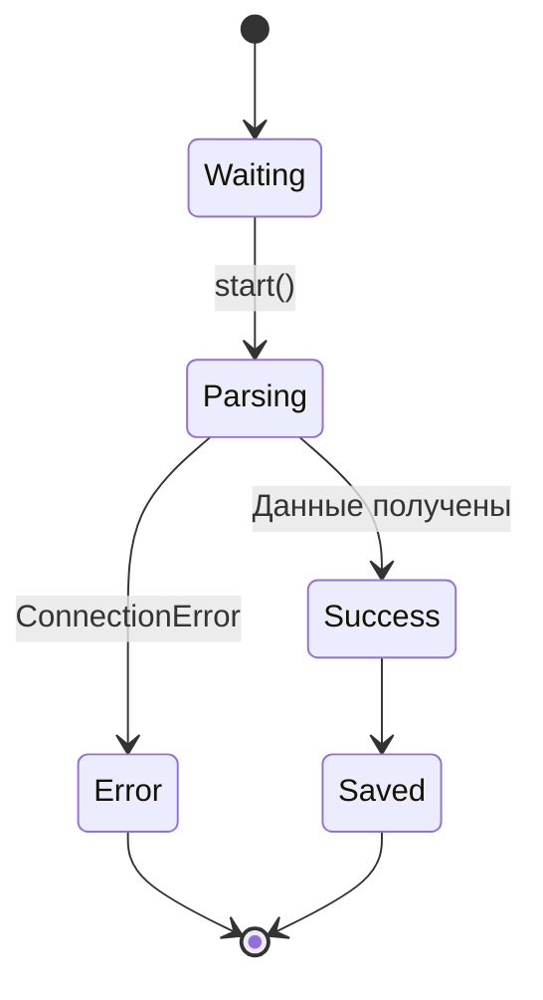
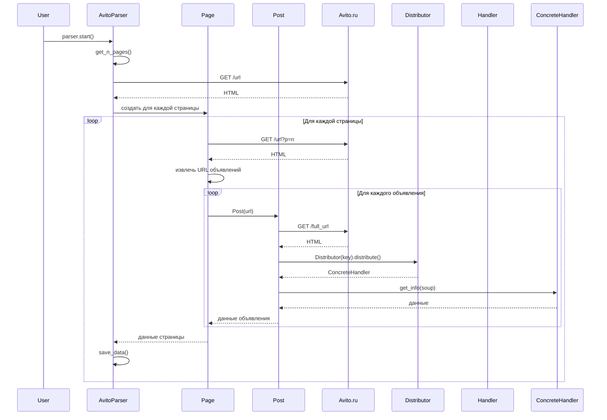
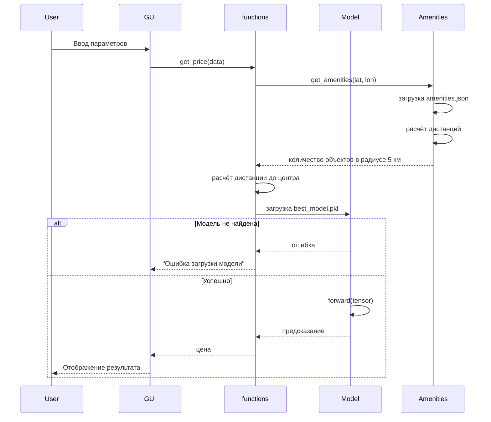
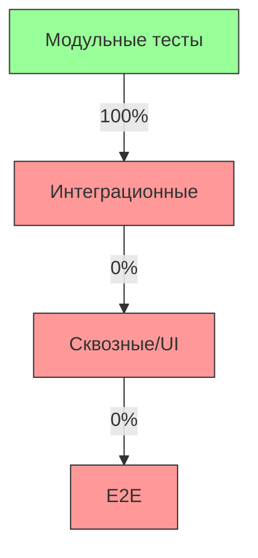

# ProjectDoc: Avito-analytics

## 1. Общая информация о проекте

### Название проекта
Avito-analytics

### Краткое описание
Проект предназначен для анализа и предсказания стоимости квартир на основе данных, собранных с платформы Avito. Состоит из четырёх основных компонентов:
- **Parsing** — сбор данных с сайта Avito по заданным параметрам.
- **Preparing_data** — очистка, обработка и подготовка данных для моделирования.
- **Modelling** — построение и исследование моделей машинного обучения.
- **Prediction** — графический интерфейс для предсказания стоимости квартиры на основе обученной модели.

Проект решает задачу автоматизации сбора данных, их подготовки и последующего прогнозирования цен на недвижимость с использованием нейросетевой модели.

### Глоссарий
| Термин | Описание |
|-------|--------|
| Avito | Российская онлайн-платформа для размещения объявлений о продаже товаров и услуг, включая недвижимость. |
| Parsing | Процесс извлечения структурированных данных из HTML-страниц объявлений на Avito. |
| Handler | Класс, отвечающий за извлечение конкретного атрибута квартиры (например, площадь, этаж, ремонт) из HTML-разметки. |
| Post | Объявление о продаже квартиры на Avito. |
| Page | Страница с несколькими объявлениями (постами) на Avito. |
| Amenities | Объекты инфраструктуры (школы, больницы, магазины и т.д.), влияющие на стоимость недвижимости. |
| BestModel | Нейросетевая модель (на основе PyTorch), используемая для предсказания стоимости квартиры. |
| LOOP_DELAY | Пауза между запросами к Avito для соблюдения этики веб-скрапинга. |

---

## 2. Зависимости и технологический стек

### Языки программирования
- Python 3.x (на основе использования `.ipynb`, `tkinter`, `requests`, `torch`)

### Ключевые библиотеки и фреймворки
| Библиотека | Версия | Назначение |
|-----------|--------|----------|
| `requests` | 2.26.0 | HTTP-запросы для получения HTML-страниц с Avito |
| `beautifulsoup4` | 4.9.3 | Парсинг HTML-разметки объявлений |
| `lxml` | 4.6.3 | Парсер для BeautifulSoup |
| `torch` | 1.10.0 | Построение и использование нейросетевой модели |
| `tkinter` | — | Графический интерфейс приложения предсказания |
| `unittest` | — | Тестирование обработчиков парсинга |

> ⚠️ Пакет `bs4==0.0.1` указан в `requirements.txt`, но он является лишь алиасом для `beautifulsoup4`. Основной функционал обеспечивается `beautifulsoup4==4.9.3`. Рекомендуется удалить `bs4` из зависимостей, чтобы избежать путаницы.

> Модель сохраняется через `torch.save()` и загружается через `torch.load()`. Формат `.pkl` используется как стандартный для PyTorch (не pickle-файл в чистом виде).

### Инструменты сборки, тестирования, линтеры
- **Сборка**: отсутствует явная система сборки (нет `setup.py`, `pyproject.toml`)
- **Тестирование**: `unittest` — используется для проверки корректности парсинга
- **Линтеры**: не указаны (отсутствуют в `requirements.txt`)

---

## 3. Архитектура и структура проекта

### Структура директорий
```
Avito-analytics/
├── Parsing/                     # Сбор данных с Avito
│   ├── AvitoParser.py           # Основной класс парсера
│   ├── Page.py                  # Работа со страницей объявлений
│   ├── Post.py                  # Работа с отдельным объявлением
│   ├── Handler.py               # Обработчики извлечения полей
│   ├── configs.json             # Конфигурация парсинга
│   ├── main.py                  # Точка входа для запуска парсера
│   └── parsing_tests/           # Тесты обработчиков
├── Preparing_data/              # Подготовка данных (Jupyter-ноутбуки)
│   ├── 1_Data_cleaning.ipynb           # Очистка данных
│   ├── 2_Outliers.ipynb                # Обработка выбросов
│   ├── 3_Categorical_features.ipynb    # Кодирование категориальных признаков
│   ├── 4_Coordinates_generation.ipynb  # Генерация координат
│   ├── 5_Amenity_feature_generation.ipynb # Генерация признаков инфраструктуры
│   └── 6_For_NN.ipynb                  # Подготовка данных для нейросети
├── Modelling/                   # Построение и исследование моделей
│   ├── 1_Removing_bad_examples.ipynb   # Удаление некачественных примеров
│   ├── 2_Best_model.ipynb              # Обучение и сравнение моделей
│   └── 3_Research.ipynb                # Исследование результатов
├── Prediction/                  # Предсказание стоимости
│   ├── functions.py             # Логика предсказания
│   └── main.py                  # GUI для предсказания
├── amenities.json               # Данные об объектах инфраструктуры
├── best_model.pkl               # Сохранённая модель PyTorch
├── clean_data.csv               # Очищенные данные после обработки
├── final_data.csv               # Финальный датасет для моделирования
├── final_train.csv              # Обучающая выборка
├── final_valid.csv              # Валидационная выборка
├── final_test.csv               # Тестовая выборка
└── requirements.txt             # Зависимости
```

### Архитектурная парадигма
Проект использует **модульную архитектуру** с чётким разделением по функциональности:
- **Parsing** — извлечение данных
- **Preparing_data** — преобразование данных
- **Modelling** — обучение модели
- **Prediction** — инференс

Архитектура близка к **слоистой (layered)**, где каждый этап зависит от предыдущего. Отсутствует микросервисная или событийная архитектура.

Согласованность формата данных между `Modelling` и `Prediction` обеспечивается ручным соответствием порядка признаков. Рекомендуется использовать схему данных (например, JSON-схему) или сохранять `feature_names` вместе с моделью.

---

### Диаграмма верхнеуровневой архитектуры


---

### Диаграмма внутренних компонентов


---

### Диаграмма изменения статусов
Хотя данные статичны, у них есть жизненный цикл: `ожидание парсинга → парсинг → ошибка/успех → сохранение → обработка`.



---

### Диаграммы последовательности

#### Сбор данных с Avito


#### Предсказание стоимости


---

### Схема базы данных
**Не применимо** — проект не использует базу данных. Все данные хранятся в CSV-файлах.

---

## 4. Основные обработчики в системе

### CLI-утилиты
Отсутствуют. Запуск осуществляется через:
- `Parsing/main.py` — запуск парсера
- `Prediction/main.py` — запуск GUI

### API-эндпоинты
Отсутствуют — проект не реализует веб-API.

### Слушатели событий из очередей
Отсутствуют — нет интеграции с Kafka, RabbitMQ и т.п.

### Отложенные фоновые задачи
Отсутствуют — нет использования Celery, Arq и т.п.

### Поддерживаемые ключи в `Distributor`
Класс `Distributor` в `Parsing/Handler.py` реализует паттерн "Фабрика", возвращая соответствующий `Handler` на основе ключа из конфигурации.

| Ключ в `params` | Обработчик | Извлекаемый элемент |
|----------------|-----------|---------------------|
| `physical address` | `PhysAddressHandler` | Адрес объявления |
| `number of rooms` | `AboutApartmentBlockHandler("Количество комнат:")` | Количество комнат |
| `area of apartment` | `AboutApartmentBlockHandler("Общая площадь:")` | Площадь квартиры |
| `kitchen area` | `AboutApartmentBlockHandler("Площадь кухни:")` | Площадь кухни |
| `living space` | `AboutApartmentBlockHandler("Жилая площадь:")` | Жилая площадь |
| `floor of apartment` | `ApartmentFloorHandler` | Этаж квартиры |
| `number of floors` | `NFloorsHandler` | Количество этажей в доме |
| `type of house` | `AboutHouseBlockHandler("Тип дома:")` | Тип дома (кирпич, панель и т.д.) |
| `repair` | `AboutApartmentBlockHandler("Ремонт:")` | Состояние ремонта |
| `price` | `PriceHandler` | Цена квартиры |
| `year of construction` | `AboutHouseBlockHandler("Год постройки:")` | Год постройки дома |
| *(любой другой)* | `EmptyHandler` | Возвращает `None` (отказоустойчивость) |

> Если ключ не распознан, возвращается `EmptyHandler`, возвращающий `None`. Это предотвращает падение парсера при неизвестном параметре.

---

## 5. Конфигурация проекта

### Основные константы
| Файл | Константа | Значение | Назначение |
|------|---------|--------|----------|
| `AvitoParser.py` | `LOOP_DELAY` | 5 | Пауза между запросами к страницам с объявлениями |
| `Page.py` | `LOOP_DELAY` | 7 | Пауза между запросами к отдельным объявлениям (более высокая нагрузка) |
| `functions.py` | `rad` | 6372795 | Радиус Земли (м) для расчёта дистанции |
| `functions.py` | `perm_esplanade_lat` | 58.010455 | Широта центра Перми |
| `functions.py` | `perm_esplanade_lon` | 56.229443 | Долгота центра Перми |
| `functions.py` | `AMENITY_RADIUS` | 5000 | Радиус поиска объектов инфраструктуры (м) |

### Переменные окружения
Отсутствуют — все конфиги хранятся в файлах:
- `Parsing/configs.json` — URL, имя файла, параметры парсинга
- `amenities.json` — координаты объектов инфраструктуры

**Секреты**: не обнаружены. Нет API-ключей, паролей и т.п.

> **Пример `Parsing/configs.json`:**
> ```json
> {
>   "url": "https://www.avito.ru/permy/kvartiry/prodam",
>   "file_name": "flats.csv",
>   "params": {
>     "number of rooms": true,
>     "area of apartment": true,
>     "price": true,
>     "physical address": true
>   }
> }
> ```
> Поля в `params` определяют, какие атрибуты извлекать.

---

## 6. Особенности реализации

### Нестандартные алгоритмы
1. **Расчёт расстояния между координатами** (`get_dist`):
   - Используется формула гаверсинуса для точного расчёта расстояния на сфере.
   - Применяется для определения близости к центру и объектам инфраструктуры.

2. **Генерация признаков по инфраструктуре** (`get_amenities`):
   - Для каждой категории (образование, здравоохранение и т.д.) считается количество объектов в радиусе 5 км.
   - Это создаёт "признак близости к инфраструктуре", влияющий на стоимость.

3. **One-hot кодирование в GUI**:
   - Категориальные признаки (ремонт, тип дома и т.д.) кодируются вручную через списки из нулей и единиц.

> ⚠️ Порядок значений в комбобоксах GUI должен строго соответствовать порядку, использованному при обучении модели. Например, `cmb_repair` должен передавать значения в порядке: `["Дизайнерский", "Евро", "Косметический", "Требует ремонта"]`.

### Паттерны проектирования
- **Стратегия (Strategy)**: реализована через `AbstractHandler` и `Distributor`. Каждый `Handler` — стратегия извлечения данных.
- **Фабрика (Factory)**: `Distributor` возвращает нужный `Handler` в зависимости от ключа.
- **Шаблонный метод**: `get_info` определён в абстрактном классе, реализуется в наследниках.

**Оценка реализации**: паттерны реализованы корректно, но можно улучшить через DI или реестр обработчиков.

---

## 7. Наблюдаемость системы

### Логирование
- Используется `print()` для вывода статуса (например, "Сохранение", "Отсутствует соединение").
- **Проблема**: отсутствует полноценная система логирования (`logging`).
- Логи выводятся в stdout.

> `print()` используется в `Parsing/AvitoParser.py`, `Parsing/Page.py`, `Parsing/Post.py` для вывода статуса соединения, URL и ошибок. Рекомендуется заменить на `logging`.

### Мониторинг
Отсутствует — нет интеграции с Prometheus, Grafana и т.п.

### Трейсинг
Отсутствует — нет OpenTelemetry, Jaeger и т.п.

---

## 8. Тестирование

### Подход к тестированию
- Используется `unittest` для проверки корректности парсинга.
- Тесты находятся в `Parsing/parsing_tests/handlers_test.py`.
- Для каждого теста:
  - Загружается HTML-файл с объявлением.
  - Загружаются ожидаемые значения из JSON.
  - Проверяется соответствие через `assertEqual`.

### Запуск тестов
```bash
python -m unittest Parsing/parsing_tests/handlers_test.py
```

### Тестовые данные
- `Parsing/parsing_tests/parsing_test_1.html`, `2.html`, `3.html` — HTML-страницы объявлений.
- `Parsing/parsing_tests/right_answers_test_*.json` — эталонные значения для полей.

### Пирамида тестирования

**Комментарий**: проект покрыт только модульными тестами (обработчики парсинга). Нет тестов для GUI, модели, интеграционных сценариев.

---

## 9. Проблемы и зоны развития

### TODO / FIXME / HACK
- Не обнаружено явных комментариев `TODO`, `FIXME`, `HACK`.

### Потенциальные баги и ограничения
1. **❗ Критическая ошибка в обработке исключений:**  
   В `Parsing/Post.py` в методе `get_data` используется `except AttributeError or TypeError`, что не перехватывает `TypeError`. Это может привести к падению приложения при ошибках парсинга.  
   **Требуется срочное исправление:** заменить на `except (AttributeError, TypeError)`.

2. **Жёстко закодированные URL**:
   - `Post.domain = "https://www.avito.ru"` — лучше вынести в конфиг.

3. **Отсутствие повторных попыток (retry)**:
   - При обрыве соединения — остановка парсинга. Нет механизма повтора.

4. **Безопасность парсинга**:
   - Нет User-Agent, заголовков — риск блокировки.
   - Нет обработки CAPTCHA.

5. **GUI не валидирует ввод**:
   - При пустом поле — `ValueError`, но обработка через `try-except` без уведомления пользователя.

6. **Модель загружается при каждом предсказании**:
   - В `get_price()` модель загружается из файла каждый раз — неэффективно. Лучше кэшировать.

7. **Отсутствие валидации данных**:
   - Нет проверки корректности координат, диапазонов значений.

8. **Зависимости**:
   - `bs4==0.0.1` — устаревшая/неактуальная версия, дублирует `beautifulsoup4`.

### Зоны развития
- Добавить полноценное логирование.
- Реализовать retry-логику при ошибках сети.
- Перевести на `logging` вместо `print`.
- Добавить валидацию ввода в GUI.
- Оптимизировать загрузку модели.
- Добавить интеграционные и E2E-тесты.
- Реализовать веб-API (FastAPI) вместо/помимо GUI.
- Приоритет для асинхронности — модуль `Parsing`, особенно `Page.get_urls()` и `Post.get_data()`, где множество HTTP-запросов могут выполняться параллельно.