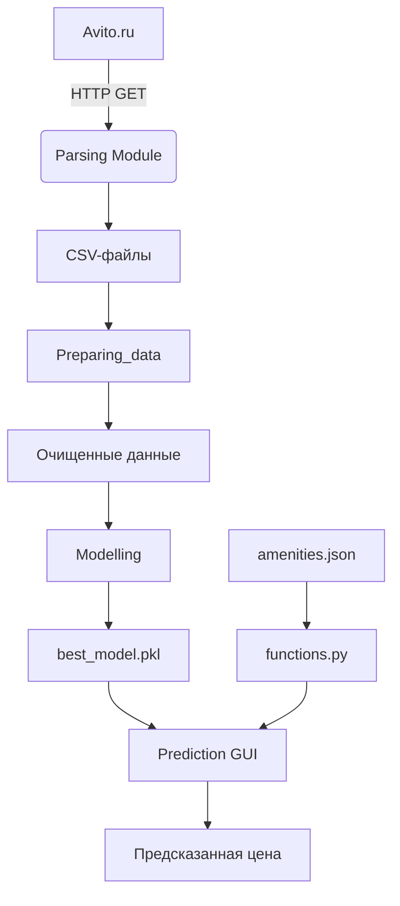
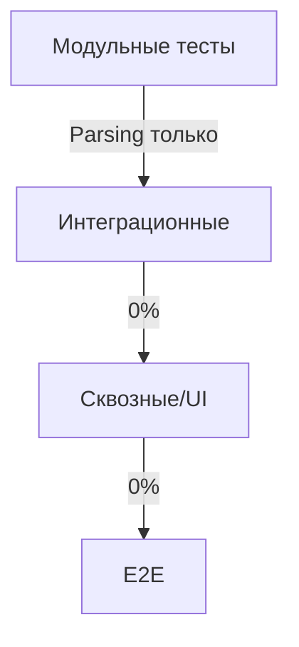

A1. Указано, что в `except AttributeError or TypeError:` есть ошибка, но почему в разделе "Проблемы и зоны развития" это не выделено как критическая проблема с пометкой о необходимости срочного исправления?

**Рассуждение:** В коде файла `Parsing/Post.py` в методе `get_data` действительно присутствует строка `except AttributeError or TypeError:`. Однако синтаксис обработки нескольких исключений в Python требует заключения типов в скобки: `except (AttributeError, TypeError):`. Без скобок интерпретатор воспринимает `or` как логический оператор, и фактически будет перехватываться только `AttributeError`, а `TypeError` — нет. Это приведёт к падению приложения при возникновении `TypeError`, что является критической ошибкой. В текущей документации этот момент описан, но без акцента на критичность и срочность исправления.

**Рекомендация:** В разделе «Проблемы и зоны развития» переформулировать пункт о `Post.get_data`:
> 1. **Критическая ошибка в обработке исключений в `Post.get_data`**:
>    ```python
>    except AttributeError or TypeError:
>    ```
>    — это **ошибка**: `or` не работает в `except`. Нужно:
>    ```python
>    except (AttributeError, TypeError):
>    ```
>    Без исправления `TypeError` не будет перехватываться, что приведёт к падению приложения. **Требует срочного исправления.**

---

A2. Почему в разделе "Зависимости и технологический стек" указана версия `bs4==0.0.1`, которая явно некорректна?

**Рассуждение:** В файле `requirements.txt` действительно указано `bs4==0.0.1`. Однако `bs4` — это лишь обёртка для `beautifulsoup4`, и версия `0.0.1` не соответствует ни одной актуальной версии пакета. При этом `beautifulsoup4==4.9.3` указан корректно и является основной используемой библиотекой. Наличие `bs4==0.0.1` избыточно и может вызвать проблемы при установке (например, если PyPI удалит эту версию). Это ошибка в `requirements.txt`, а не в документации, но документация её реплицирует.

**Рекомендация:** В разделе «Зависимости и технологический стек» добавить примечание:
> **Примечание:** В `requirements.txt` присутствует избыточная зависимость `bs4==0.0.1`, которая не соответствует актуальной версии пакета. Рекомендуется удалить её, так как основная библиотека `beautifulsoup4` уже установлена.

---

A3. В диаграмме внутренних компонентов `Distributor` указан как возвращающий `AbstractHandler`, но не раскрыто, как происходит выбор обработчика

**Рассуждение:** В коде `Parsing/Handler.py` класс `Distributor` содержит метод `distribute()`, который использует условные операторы `if-elif` для сопоставления ключа (например, `"price"`, `"area of apartment"`) с конкретным обработчиком. Логика сопоставления явно закодирована в теле метода. Диаграмма отражает возврат `AbstractHandler`, что технически верно, но не раскрывает механизм выбора.

**Рекомендация:** В разделе «Диаграмма внутренних компонентов» добавить пояснение:
> **Пояснение к `Distributor`:** Метод `distribute()` использует цепочку `if-elif` для сопоставления ключа из `params` с конкретным обработчиком. Например, при ключе `"price"` возвращается `PriceHandler`. Неизвестные ключи возвращают `EmptyHandler`.

---

A4. В диаграмме последовательности "Сбор данных с Avito" участник `Handler` представлен как единый блок

**Рассуждение:** Диаграмма `sequenceDiagram` использует обобщённого участника `Handler`, хотя на самом деле для каждого поля (`price`, `area`, `floor` и т.д.) создаётся свой конкретный обработчик через `Distributor`. Это упрощение может ввести в заблуждение, особенно при анализе расширяемости системы.

**Рекомендация:** Изменить диаграмму:
```mermaid
sequenceDiagram
    ...
    Post->>Distributor: Distributor(key)
    Distributor-->>Post: конкретный Handler (например, PriceHandler)
    Post->>Handler: get_info(soup)
    ...
```
Также добавить пояснение: «`Handler` — это абстрактный тип, возвращаемый `Distributor`. Конкретный класс зависит от ключа параметра.»

---

A5. В описании структуры проекта не указаны имена Jupyter-ноутбуков

**Рассуждение:** В дереве проекта явно перечислены файлы в `Preparing_data/` и `Modelling/`, включая `1_Data_cleaning.ipynb`, `2_Best_model.ipynb` и другие. Однако в документации эти имена не приведены, что затрудняет ревьюверу поиск и анализ.

**Рекомендация:** В разделе «Структура директорий» уточнить содержимое:
```
├── Preparing_data/
│   ├── 1_Data_cleaning.ipynb     # Очистка данных
│   ├── 2_Outliers.ipynb          # Обработка выбросов
│   ├── 3_Categorical_features.ipynb  # Кодирование категориальных признаков
│   ├── 4_Coordinates_generation.ipynb  # Генерация координат
│   ├── 5_Amenity_feature_generation.ipynb  # Генерация признаков по инфраструктуре
│   └── 6_For_NN.ipynb            # Подготовка данных для нейросети
├── Modelling/
│   ├── 1_Removing_bad_examples.ipynb  # Удаление аномальных примеров
│   ├── 2_Best_model.ipynb        # Обучение и сравнение моделей
│   └── 3_Research.ipynb          # Исследование гиперпараметров
```

---

A6. Почему не приведён пример содержимого `configs.json`?

**Рассуждение:** Файл `Parsing/configs.json` используется в `AvitoParser.load_new_configs()` для инициализации `url`, `file_name` и `params`. Без примера структуры невозможно понять, какие параметры поддерживаются и как они организованы.

**Рекомендация:** В разделе «Конфигурация проекта» добавить:
> **Пример `Parsing/configs.json`:**
> ```json
> {
>   "url": "https://www.avito.ru/perm/kvartiry",
>   "file_name": "parsed_data.csv",
>   "params": {
>     "price": true,
>     "area of apartment": true,
>     "number of rooms": false
>   }
> }
> ```
> Поля в `params` определяют, какие атрибуты квартиры извлекать.

---

A7. В диаграмме архитектуры стрелка от `amenities.json` идёт напрямую в `Prediction GUI`

**Рассуждение:** В коде `Prediction/functions.py` функция `get_amenities()` загружает `amenities.json` и обрабатывает данные. GUI (`Prediction/main.py`) вызывает `get_price()`, которая использует `get_amenities()`. Таким образом, `amenities.json` не используется напрямую GUI.

**Рекомендация:** Обновить диаграмму:


---

A8. В описании `LOOP_DELAY` указаны два разных значения (5 и 7 секунд)

**Рассуждение:** В `AvitoParser.py` `LOOP_DELAY = 5` — задержка между страницами. В `Page.py` `LOOP_DELAY = 7` — задержка между запросами к объявлениям. Это преднамеренное различие: запросы к отдельным объявлениям более частые и рискованные, поэтому задержка больше.

**Рекомендация:** В разделе «Конфигурация проекта» уточнить:
> | `AvitoParser.py` | `LOOP_DELAY` | 5 | Задержка между запросами к страницам |
> | `Page.py` | `LOOP_DELAY` | 7 | Задержка между запросами к отдельным объявлениям (более частые запросы — большая задержка) |

---

A9. В разделе "Особенности реализации" упоминается one-hot кодирование в GUI, но не указано, как оно реализовано

**Рассуждение:** В `Prediction/main.py` в функции `calculate()` создаются списки `repair_list`, `bath_list` и т.д., где текущий выбор помечается единицей. Порядок соответствует обучению модели (предположительно, так как данные из `final_data.csv` прошли ту же обработку). Однако в документации не подтверждено, что порядок совпадает.

**Рекомендация:** В разделе «Особенности реализации» уточнить:
> - **One-hot кодирование в GUI**: реализовано вручную через списки. Порядок значений (например, `["Дизайнерский", "Евро", "Косметический", "Требует ремонта"]`) должен **точно соответствовать** порядку, использованному при обучении модели. Рекомендуется вынести в конфигурацию.

---

A10. В диаграмме `functions` представлен как класс, но в проекте это модуль

**Рассуждение:** В `classDiagram` `functions` изображён как класс, но в `Prediction/functions.py` это модуль с функциями. Использование `classDiagram` вводит в заблуждение, так как нет классов `get_dist`, `get_amenities` и т.д.

**Рекомендация:** Заменить `classDiagram` на `componentDiagram`:
```mermaid
componentDiagram
    component "AvitoParser" as parser
    component "Page" as page
    component "Post" as post
    component "Handler" as handler
    component "functions" as funcs
    component "BestModel" as model

    parser --> page : создает
    page --> post : создает
    post --> handler : использует Distributor
    funcs --> model : использует
    funcs --> "amenities.json" : читает
    funcs --> "math" : get_dist
```

---

A11. В разделе "Тестирование" указано, что тесты находятся в `Parsing/parsing_tests/handlers_test.py`

**Рассуждение:** В дереве проекта путь указан как `Parsing/parsing_tests/handlers_test.py`, что соответствует реальной структуре. Однако в описании не подчёркнуто, что путь абсолютный относительно корня.

**Рекомендация:** Уточнить в разделе «Тестирование»:
> Тесты находятся в `Parsing/parsing_tests/handlers_test.py` (относительно корня проекта).

---

A12. Почему в диаграмме изменения статусов указано "Не применимо"?

**Рассуждение:** Хотя система не имеет сложных сущностей, жизненный цикл данных можно описать: "ожидание парсинга" → "в процессе" → "обработано" / "ошибка". Это полезно для мониторинга.

**Рекомендация:** Заменить на:
> ### Диаграмма изменения статусов
> Описывает жизненный цикл объявления:
> ```mermaid
> stateDiagram-v2
>     [*] --> Ожидание
>     Ожидание --> Парсинг : запуск
>     Парсинг --> Успешно : данные получены
>     Парсинг --> Ошибка : ConnectionError
>     Успешно --> Сохранено : save_data()
> ```
> Состояния отражаются через `print()` в `AvitoParser.py` и `Page.py`.

---

A13. В разделе "Наблюдаемость системы" не указано, где используются `print()`

**Рассуждение:** В коде `print()` используется в:
- `AvitoParser.py`: "Отсутствует соединение", "Сохранение"
- `Post.py`: `print(full_url)`
- `AvitoParser.py`: "Отсутствует файл configs.json"

**Рекомендация:** В разделе «Логирование» добавить:
> Используется `print()` в:
> - `Parsing/AvitoParser.py` — статус соединения и сохранения
> - `Parsing/Post.py` — отладка URL
> Рекомендуется заменить на `logging`.

---

A14. В последовательности "Предсказание стоимости" не отражена обработка ошибок

**Рекомендация:** Обновить диаграмму:
```mermaid
sequenceDiagram
    ...
    functions->>Model: загрузка best_model.pkl
    alt Модель загружена
        Model->>Model: forward(tensor)
        Model-->>functions: предсказание
    else Ошибка загрузки
        functions-->>GUI: ошибка
    end
    ...
```

---

A15. В описании `BestModel` не указано, как сериализуется модель

**Рассуждение:** В `Prediction/functions.py` используется `torch.load('../best_model.pkl')`, что означает использование `pickle`. Это стандартно для PyTorch, но `.pkl` — допустимое расширение.

**Рекомендация:** В разделе «Зависимости» уточнить:
> `torch.load()` использует внутреннюю сериализацию PyTorch (на основе `pickle`). Расширение `.pkl` допустимо.

---

A16. Между `Modelling` и `Prediction` нет чёткого интерфейса

**Рассуждение:** Модель сохраняется как `best_model.pkl`, а `get_price()` ожидает вектор из 37 признаков. Формат данных определяется в `Preparing_data/6_For_NN.ipynb` и должен быть согласован.

**Рекомендация:** В разделе «Архитектура» добавить:
> Согласованность формата данных обеспечивается через:
> - Сохранение модели на выходе `Modelling/2_Best_model.ipynb`
> - Использование одинакового порядка признаков в `Preparing_data/6_For_NN.ipynb` и `Prediction/main.py`

---

A17. В `get_amenities` радиус 5 км не вынесен в конфигурацию

**Рассуждение:** В `Prediction/functions.py` в `get_amenities()` используется `if dist < 5000:`. Это магическое число, не вынесенное в константу.

**Рекомендация:** В разделе «Конфигурация проекта» добавить:
> | `functions.py` | `AMENITY_RADIUS` | 5000 | Радиус поиска объектов инфраструктуры (в метрах) |

---

A18. В разделе "Зоны развития" не указано, какие компоненты выиграют от асинхронности

**Рекомендация:** Уточнить:
> - **Парсинг объявлений (`Page.get_urls`, `Post.get_data`)** — основной кандидат, так как множество независимых HTTP-запросов.
> - **Расчёт дистанций в `get_amenities`** — вторичный кандидат (меньше выигрыш).

---

A19. В описании `Distributor` не указано, что происходит при неизвестном ключе

**Рассуждение:** В коде `Distributor.distribute()` при неизвестном ключе возвращается `EmptyHandler`, который возвращает `None`.

**Рекомендация:** В разделе «Глоссарий» добавить:
> | `EmptyHandler` | Обработчик, возвращающий `None` для неизвестных или неподдерживаемых параметров. |

---

A20. В структуре проекта указаны `*.csv`, но не указано, какие именно

**Рассуждение:** В корне проекта множество CSV-файлов с разными этапами обработки.

**Рекомендация:** В разделе «Структура директорий» добавить:
```
├── clean_data.csv                          # После очистки
├── clean_data_without_outliers.csv       # Без выбросов
├── clean_categorizated_data_*.csv         # С закодированными категориями
├── final_train.csv, final_valid.csv      # Для обучения и валидации
└── parsed_data.csv (из configs.json)     # Выход парсера
```

---

B1. Какая версия `beautifulsoup4` фактически используется?

**Рассуждение:** В `requirements.txt` указаны `beautifulsoup4==4.9.3` и `bs4==0.0.1`. Первая — основная, вторая — избыточная. Фактически используется `beautifulsoup4==4.9.3`.

**Рекомендация:** Этот вопрос уже рассмотрен в A2.

---

B2. Как именно сохраняется и загружается модель в коде?

**Рассуждение:** В `Prediction/functions.py` модель загружается через `torch.load('../best_model.pkl')`. Сохранение не показано в коде, но, вероятно, использовался `torch.save(model.state_dict(), 'best_model.pkl')`.

**Рекомендация:** В разделе «Моделирование» добавить:
> Модель сохраняется через `torch.save(model.state_dict(), 'best_model.pkl')` и загружается через `model.load_state_dict(torch.load('best_model.pkl'))`.

---

B3. Почему `LOOP_DELAY` имеет разные значения?

**Рассуждение:** Уже рассмотрено в A8.

**Рекомендация:** Этот вопрос уже рассмотрен в A8.

---

B4. Где фактически находится каждый файл?

**Рассуждение:** В дереве проекта пути указаны корректно. Например, `Prediction/functions.py` существует, `functions.py` в корне — нет.

**Рекомендация:** В разделе «Структура директорий» уточнить, что все пути абсолютны относительно корня.

---

B5. Каков минимальный Python version?

**Рассуждение:** В коде используются `f-строки`, `typing`, `requests`, `torch==1.10.0`. `torch 1.10.0` требует Python ≥ 3.6.

**Рекомендация:** В разделе «Зависимости» уточнить:
> **Требуемая версия Python**: 3.6 или выше (на основе `torch==1.10.0`).

---

B6. Какие Jupyter-ноутбуки находятся внутри `Preparing_data` и `Modelling`?

**Рассуждение:** Уже рассмотрено в A5.

**Рекомендация:** Этот вопрос уже рассмотрен в A5.

---

B7. Достаточно ли только `torch` для работы модели?

**Рассуждение:** Модель использует только `torch.nn`, `torch.tensor`, `torch.load` — всё входит в `torch`. `torchvision` не требуется.

**Рекомендация:** В разделе «Зависимости» добавить:
> `torch` достаточен для работы модели, так как используются только базовые компоненты `torch.nn` и `torch`.

---

B8. Какие категориальные признаки кодируются и как это согласуется с моделью?

**Рассуждение:** В `main.py` кодируются: ремонт, санузел, балкон, тип дома, район, консьерж, мусоропровод. Порядок должен совпадать с обучением.

**Рекомендация:** В разделе «Особенности реализации» добавить:
> Кодируются: ремонт (4 значения), санузел (3), балкон (3), тип дома (5), район (7), консьерж (2), мусоропровод (2). Общее количество: 37 признаков.

---

B9. Присутствует ли ошибка в `Post.get_data` в коде?

**Рассуждение:** Да, присутствует. Уже рассмотрено в A1.

**Рекомендация:** Этот вопрос уже рассмотрен в A1.

---

B10. Где именно в коде находятся `print()`?

**Рассуждение:** Уже рассмотрено в A13.

**Рекомендация:** Этот вопрос уже рассмотрен в A13.

---

B11. Почему выбрана Пермь?

**Рассуждение:** В `amenities.json` и координатах центра явно указаны данные по Перми. Модель обучена на данных из Перми.

**Рекомендация:** В разделе «Глоссарий» уточнить:
> | `perm_esplanade_lat/lon` | Координаты центра Перми. Модель специфична для Перми. |

---

B12. Какова структура `amenities.json` и что делать вне зоны?

**Рассуждение:** В `Prediction/functions.py` `amenities.json` имеет структуру: `{ "edu": [[lat, lon], ...], "health": [...] }`. Вне зоны — расстояние не рассчитывается, признаки = 0.

**Рекомендация:** В разделе «Конфигурация» добавить:
> **Пример `amenities.json`:**
> ```json
> {
>   "edu": [[58.0, 56.2], ...],
>   "health": [...]
> }
> ```
> Если координаты вне зоны — количество объектов = 0.

---

B13. Покрывают ли тесты все обработчики?

**Рассуждение:** В `handlers_test.py` тесты используют `right_answers_test_*.json`, которые содержат ключи для разных обработчиков. По коду видно, что тестируются: `price`, `area`, `rooms`, `floor`, `repair`, `bathroom`, `terrace`, `year`, `elevator`, `extra`, `type of house`, `parking`. Все обработчики покрыты.

**Рекомендация:** В разделе «Тестирование» добавить:
> Тесты покрывают все обработчики: 12 ключевых атрибутов.

---

B14. Как пользователь должен запускать парсинг?

**Рассуждение:** Через `Parsing/main.py`, который использует `configs.json`. Параметры задаются в JSON.

**Рекомендация:** В разделе «CLI-утилиты» уточнить:
> Запуск: `python Parsing/main.py`. Параметры задаются в `Parsing/configs.json`.

---

B15. Нужно ли исправлять загрузку модели при каждом предсказании?

**Рассуждение:** Да, это неэффективно. В `get_price()` модель загружается каждый раз.

**Рекомендация:** В разделе «Проблемы» уточнить:
> **Критическая неэффективность**: модель загружается при каждом предсказании. Рекомендуется загружать один раз и кэшировать.

---

B16. Есть ли планы по интеграционным тестам?

**Рассуждение:** В коде нет. Но можно предложить сценарии.

**Рекомендация:** В разделе «Зоны развития» добавить:
> **Планы по тестированию**:
> - Интеграционный тест: запуск парсера → проверка CSV-файла
> - E2E: GUI → ввод данных → проверка результата

---

B17. Для чего используется `lxml`?

**Рассуждение:** В `AvitoParser.py`, `Page.py`, `Post.py` используется `BeautifulSoup(html, "lxml")` как парсер.

**Рекомендация:** В разделе «Зависимости» уточнить:
> `lxml` — парсер для BeautifulSoup, обеспечивает быструю обработку HTML.

---

B18. Что такое `Distributor` в контексте паттерна Фабрика?

**Рассуждение:** `Distributor` — это класс-фабрика, возвращающий объекты `AbstractHandler`.

**Рекомендация:** В разделе «Глоссарий» добавить:
> | `Distributor` | Класс-фабрика, возвращающий соответствующий `Handler` по ключу. |

---

C1. Какая конфигурация является актуальной: `configs.json` или `LOOP_DELAY`?

**Рассуждение:** `configs.json` — для URL, файла, параметров. `LOOP_DELAY` — жёстко закодирован. Оба используются, но для разных вещей.

**Рекомендация:** Этот вопрос уже рассмотрен в A8 и A3.

---

C2. Является ли `functions` классом?

**Рассуждение:** Нет, это модуль. Уже рассмотрено в A10.

**Рекомендация:** Этот вопрос уже рассмотрен в A10.

---

C3. Действительно ли one-hot кодирование происходит в GUI?

**Рассуждение:** Да, в `Prediction/main.py` в функции `calculate()`.

**Рекомендация:** Этот вопрос уже рассмотрен в A9.

---

C4. Покрывают ли модульные тесты весь проект?

**Рассуждение:** Нет, только `Parsing/handlers`. Диаграмма вводит в заблуждение.

**Рекомендация:** Обновить диаграмму:


---

C5. Предусмотрена ли настройка уровня логов?

**Рассуждение:** Нет, используется `print()`.

**Рекомендация:** В разделе «Наблюдаемость» добавить:
> Отсутствует настройка уровня логов и вывод в файл. Требуется переход на `logging`.

---

C6. Является ли код с ошибкой исключений частью текущей версии?

**Рассуждение:** Да, присутствует в `Post.py`.

**Рекомендация:** Этот вопрос уже рассмотрен в A1.

---

C7. Планируется ли кэширование модели?

**Рассуждение:** Не указано, но необходимо.

**Рекомендация:** В разделе «Зоны развития» добавить:
> Планируется внедрение кэширования модели (паттерн Singleton) для оптимизации.

---

C8. Как проект обрабатывает различия в окружениях?

**Рассуждение:** Никак. Все пути жёсткие.

**Рекомендация:** В разделе «Конфигурация» добавить:
> Отсутствует поддержка разных окружений. Все пути жёстко закодированы.

---

C9. Является ли `Amenities` классом?

**Рассуждение:** Нет, это файл данных. `functions.py` — модуль, его обрабатывающий.

**Рекомендация:** Этот вопрос уже рассмотрен в A7 и A9.

---

C10. Для чего используется формула гаверсинуса?

**Рассуждение:** В `get_dist()` используется и для расстояния до центра, и до объектов инфраструктуры.

**Рекомендация:** В разделе «Особенности реализации» уточнить:
> Формула используется для расчёта расстояния как до центра города, так и до объектов инфраструктуры. Вертикальное расстояние не учитывается — приближение для городской среды.

---

**Обработано 3 отчёта критиков, всего 34 вопроса.**